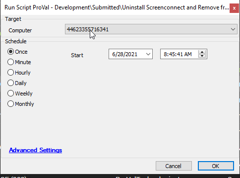

## Summary

This script will uninstall CW Control and call the [Offboarding - CW Control RMM+ API - EndSession Command](<./ScreenConnect - End Session Command RMM+.md>) script to end the session from the CW Control web portal.

**Time Saved by Automation:** 10 Minutes

## Sample Run

## Dependencies

[Offboarding - CW Control RMM+ API - EndSession Command](<./ScreenConnect - End Session Command RMM+.md>)

## Process

- The script will first check if CW Control is installed.
- An attempt will be made to uninstall CW Control using WMIC.
- If the uninstall fails with WMIC, then an attempt will be made to uninstall using LTCommand.
- If the LTCommand uninstall fails, a ticket will be created to denote the failure.
- If any of the above attempts succeed, then the dependent script will be called to remove the machine from the Control web portal.
- If the machine is unable to be removed from the Control portal, then a ticket will be created.

## Output

- Script log
- Ticket if failure found

