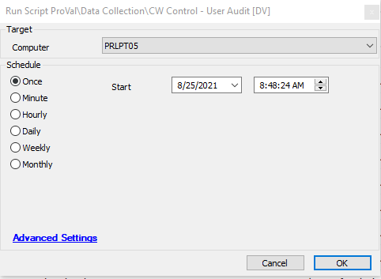

## Summary

This script runs on the Control server and audits ConnectWise Control user information to a custom table [plugin_proval_controluseraudit](<../tables/plugin_proval_controluseraudit.md>).

It displays information in the dataview **@CW Control - User Audit**.  
**Time Saved by Automation:** 15 Minutes

## Sample Run

## Dependencies

- Must be run on Control Server
- [plugin_proval_controluseraudit](<../tables/plugin_proval_controluseraudit.md>)

## Variables

- `@insertStatement@` - Fetches the information of all the users that will be inserted into the custom table.
- `@2FAColumnExists@` - Verifies if the 2FA column exists or not.

## Process

- Runs PowerShell and fetches all the information of Control users.
- Verifies if the 2FA column exists; if it doesn't exist, it will drop the table; otherwise, it creates the table with all the information.

## Output

- Script log
- Dataview **@CW Control - User Audit**

