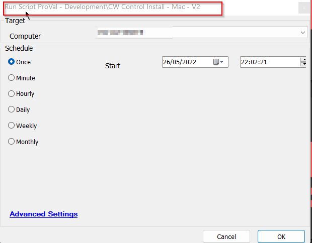

## Summary

The script will perform a fresh installation, or a removal and reinstallation of the CW Control agent on a Mac device.

## Sample Run

## Variables

| Name           | Description                                                  |
|----------------|--------------------------------------------------------------|
| instanceid     | instanceid of the integrated screenconnect.                 |
| Client         | Client Name with all the spaces replaced with %20           |
| Location       | Location Name with all the spaces replaced with %20         |
| macdownloadurl  | Download URL generated from database to download a pkg installer |
| SessionGUID    | GUID of the installed instance                                |

## Process

1. Finds the instanceid, it is used in the installation command.
2. Turns on FastTalk.
3. Generates the Download URL.
4. Downloads the .pkg file and defines it as executable.
5. Removes the older instances and their traces.
6. Executes the installation Command.
7. Verifies the installation.
8. Updates the GUID in plugin_screenconnec_scinstalled table.

## Output

- Script Logs

