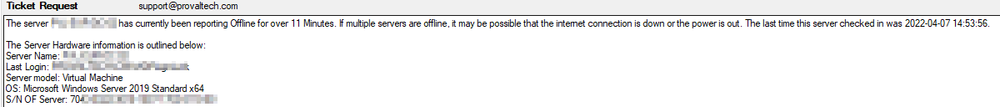
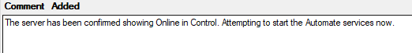
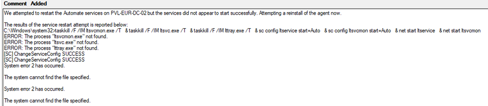
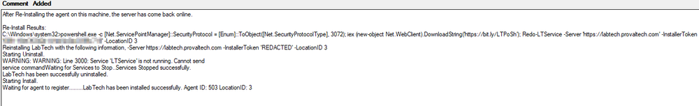
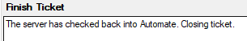

## Summary

This script is designed to be triggered by a monitor. It will not function if run manually. It will create a ticket for offline servers and perform troubleshooting steps and add comments to the ticket as troubleshooting steps are made.

## Dependencies

This script is dependent on the following items:

- RMM+ Installed and configured in CW Control/Automate

#### Global Parameters

| Name                  | Example                                                                 | Required | Description                                                                                                                                           |
|-----------------------|-------------------------------------------------------------------------|----------|-------------------------------------------------------------------------------------------------------------------------------------------------------|
| OfflineThreshold      | 11                                                                      | True     | This indicates how many minutes the offline server monitor will alert after. Default is set to 11 minutes. (This needs to be set to whatever your monitoring is set to) |
| TicketCreateSubject   | LT - Server Offline for %LocationName% / %ComputerName% (%ComputerID%) | True     | This indicates what the ticket subject will look like. Default is the example output.                                                               |

## Process

1. Create the server offline ticket
2. Check CW Control to see if the machine is online
   - The Machine is Offline
     - Add a comment to the ticket confirming the machine is offline in Control
   - The Machine is Online
     - Attempt to force restart the Automate services
       - Services report they started successfully
         - Go through a 3 Minute loop validating the machine is online now, If it doesn't --> Jump to Reinstall Task
       - Services had an error
         - Comment Ticket with an update. Begin Re-install
         - If the Re-Install does not work, add a comment with the re-install command results and the last 15 lines of the Automate LTErrors log in the ticket.
3. If at any time, the script fixes the agent and the machine is now online, it will add a comment to the ticket stating that it fixed the issue and the monitor will automatically close the ticket.

## Output

The script is designed to consistently update the ticket with new information as it does its troubleshooting. Below are a few examples of ticket data getting added as troubleshooting is occurring.

