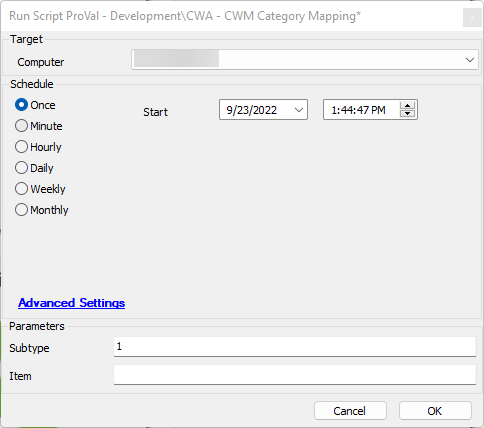

## Summary

This script will map Categories from automate to manage. 

The following assumptions are made:

- The minimum desired without setting any user variable is to apply mapping to the board and the type.
- Specifying 1 in subtype and 0 in item will result in mapping the board, the type, and the subtype.
- Specifying 1 in item and 0 in subtype will result in mapping the board, the type, the subtype, and the item.
- Specifying 1 in item and 1 in subtype will result in mapping the board, the type, the subtype, and the item.

## Sample Run

This will map the Board, Type, and Subtype to manage.

## Dependencies

- CW Manage Plugin Setup and Service Board import must be completed.

## Variables

Document the various variables in the script. Delete any section that is not relevant to your script.

| Name                | Description                              |
|---------------------|------------------------------------------|
| ICQUERY             | Holds the sql query to get the Categories |
| MapToManageQuery    | Maps the query to manage table           |
| UpdateExistingQuery | Updates any existing category.           |

#### UserVariables

| Name     | Example | Required | Description                                       |
|----------|---------|----------|---------------------------------------------------|
| Subtype  | 1       | False    | Set to 1 to include subtype in mapping            |
| Item     | 1       | False    | Set to 1 to include item in mapping, trumps subtype. |

## Process

1. If a backup hasn't occurred in the last 24 hours log the issue and exit with error.
2. Determine the scope of the mapping.
3. Set the query variables based on the desired mapping.
4. Execute the query variables.
5. Exit.

## Output

- Script log

## FAQ

**Q:** What Happens if I set both Subtype and Item to 1?  
**A:** The script checks for Item first, as it trumps Subtype, and adds both the subtype and the item mapping.

