## Purpose

This article outlines the process to add the `Windows Feature Update` option in the `Self Help` menu.  
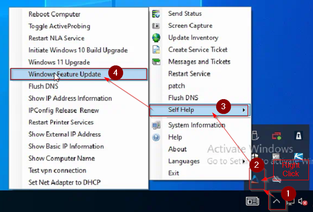  

The `Windows Feature Update` option runs the `Install Windows Upgrade` [script](https://proval.itglue.com/DOC-5078775-12028460) to install the latest available feature pack for the computer.

## Dependencies

[EPM - Windows Configuration - Script - Install Windows Upgrade](https://proval.itglue.com/DOC-5078775-12028460)  

## Implementation

1. Update/Import the [Install Windows Upgrade](https://proval.itglue.com/DOC-5078775-12028460) using the `Prosync` Plugin.

2. Reload System Cache:  
     

3. Navigate to Automation > Templates > Agent Templates:  
   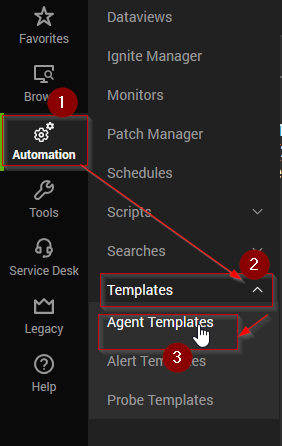  

4. Agent Templates menu will appear:  
   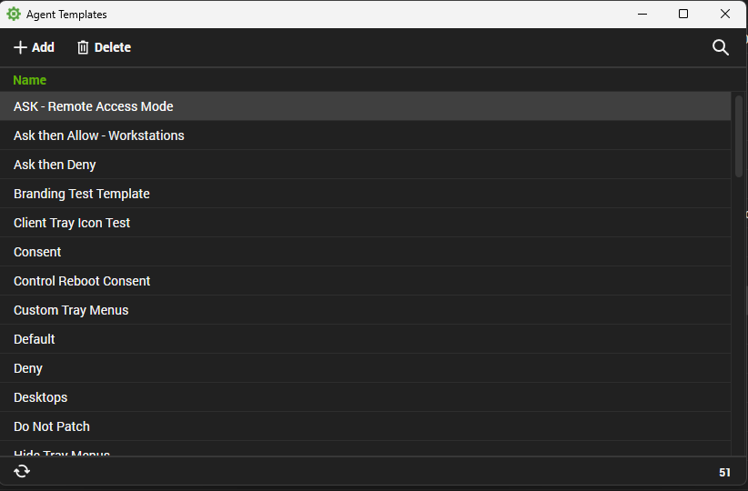  

5. Double-click and open the agent template which is being used to manage the `Self Help` menu. We are using the `Default` agent template in the illustrations:  
   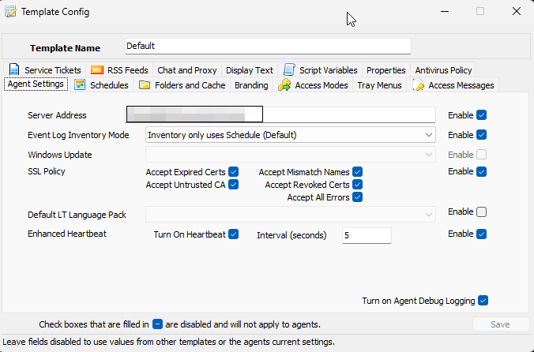  

6. Navigate to `Tray Menus` and click the `New Menu` button:  
   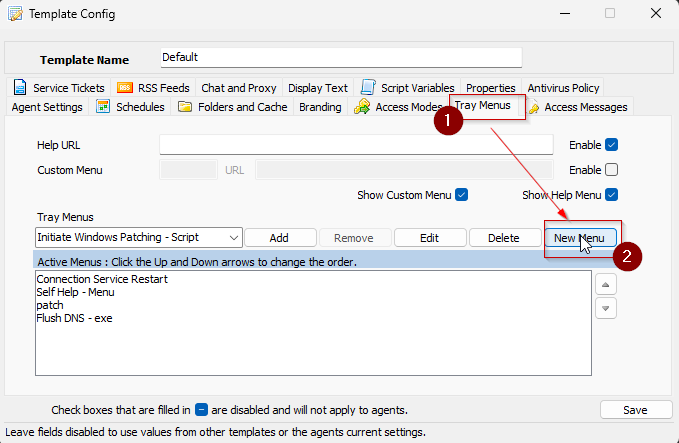  

7. - **Name**: Windows Feature Update  
   - **Description**: Performs Windows 10 and 11 Feature Update  
   - **Menu Text**: Windows Feature Update  
   - **Menu Action**: Script  
   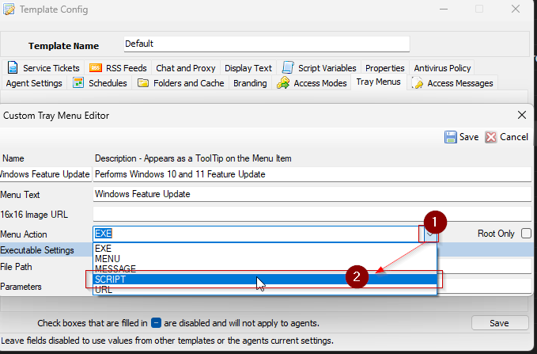  

8. Select the `ProVal/Windows/Install Windows Upgrade*` script from the `Select a Script` dropdown menu.  
   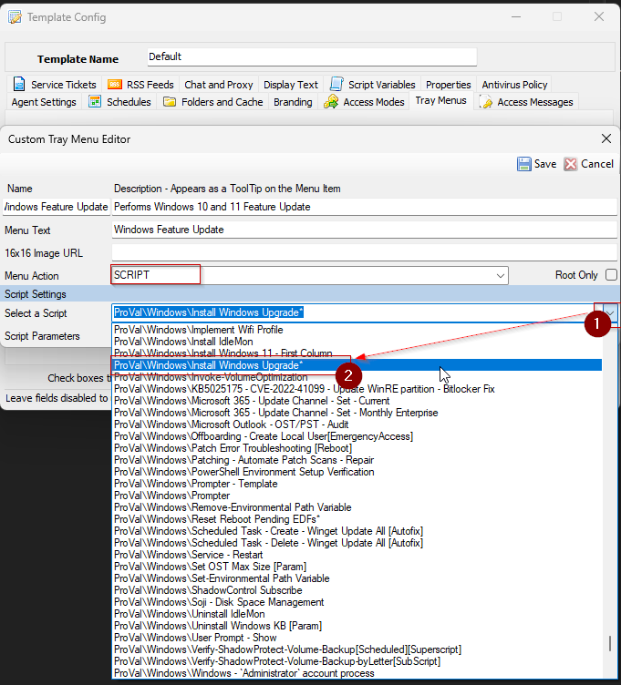  

9. Click the `Save` button to save the changes made to the `Custom Tray Menu Editor`:  
   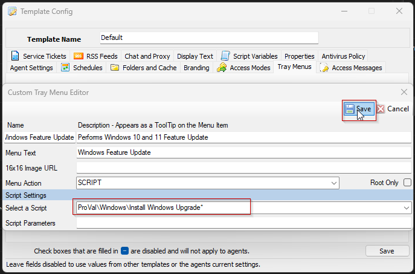  

10. `Double Click` the `Self Help - Menu`:  
    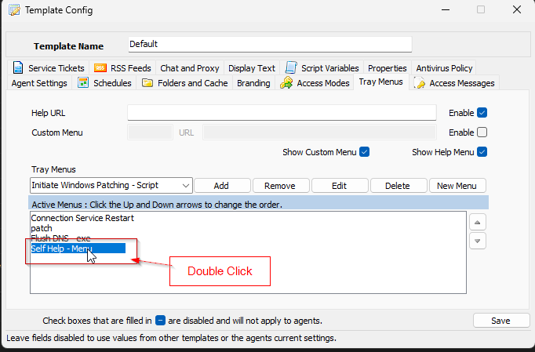  

11. Select `Self Help - Menu` from the `Tray Menus` dropdown and click the `Edit` button to add the `Windows Feature Update` menu to the `Self Help - Menu`.  
    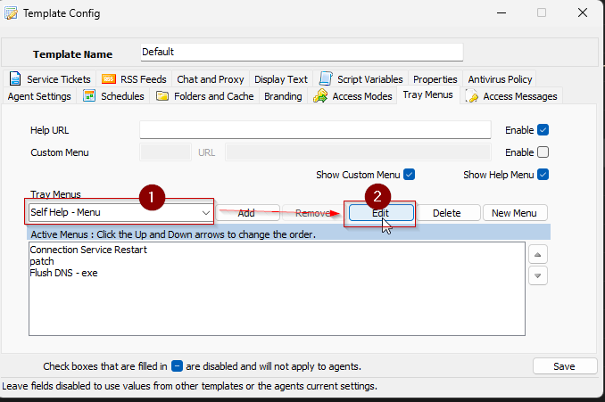  

12. `Custom Tray Menu Editor` will appear for the `Self Help - Menu`:  
    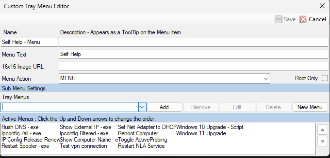  

13. Select the `Windows Feature Update` menu from the `Tray Menus` dropdown.  
    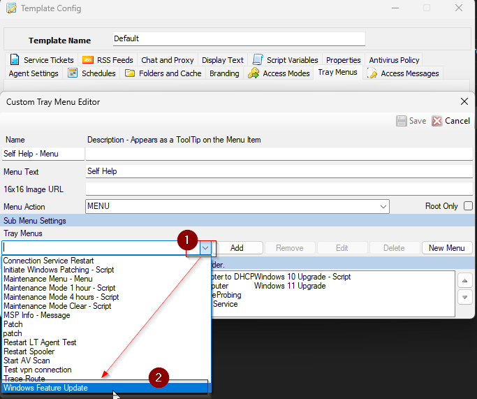  

14. Click the `Add` button to add the `Windows Feature Update` menu in the Active Menus list.  
    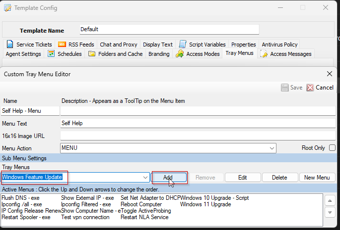  

15. Click the `Save` button to save the changes made to the `Self Help - Menu`.  
    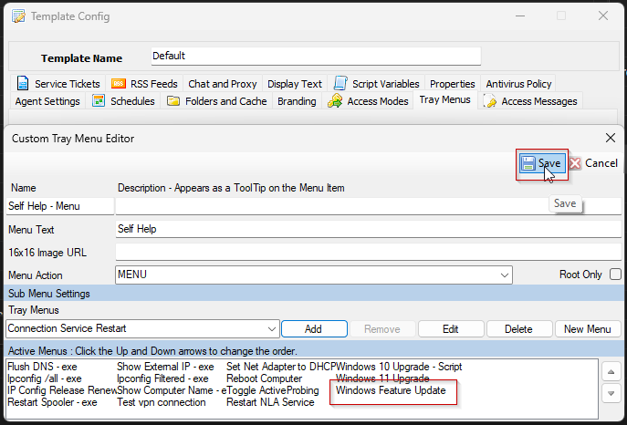  

16. Add back the `Self Help - Menu` to the agent template's active menus:  
    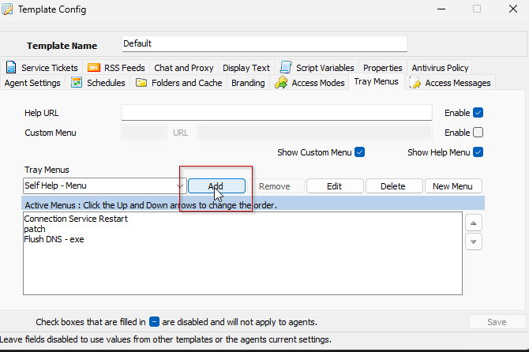  

17. Click the `Save` button to save the changes made to the agent template.  
    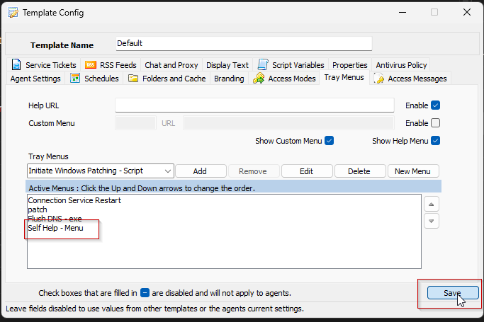  

Configuration updates will take effect on devices after running the `Update Config` command.

