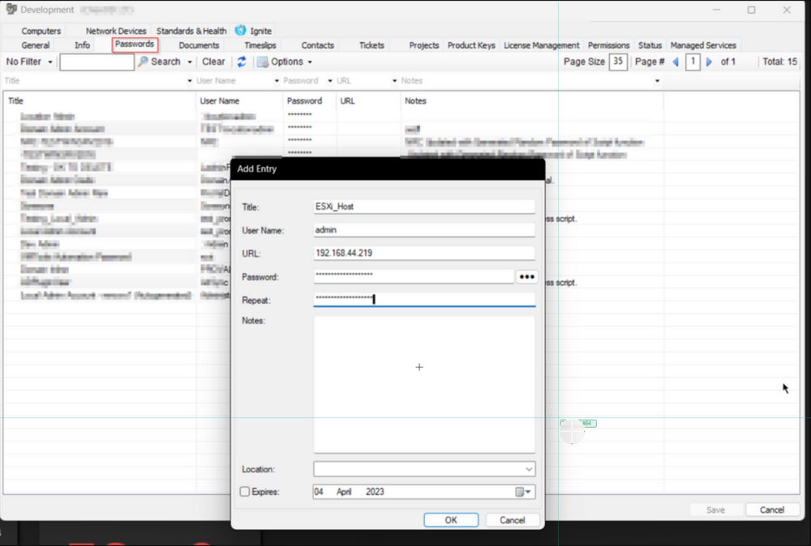
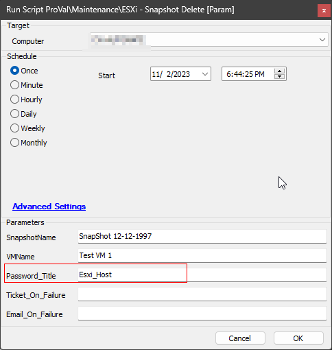
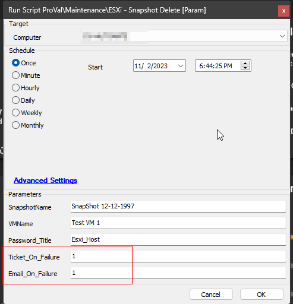

## Summary

This script can be used to delete a snapshot of a machine hosted on an ESXi host server. It utilizes the [PowerCLI Module](https://www.powershellgallery.com/packages/VMware.PowerCLI/12.0.0.15947286) to perform the required action.

**Note:** The script must be executed from a machine that can reach the ESXi Host.

## Prerequisites

- .NET Framework 4.7.2+ (Release: 461808)
- PowerShell v5.1+

## Sample Run

1. Create a credential entry on the client's password tab to connect with the ESXi Host. It must be an admin/root-level credential.
2. Add either the public or private IP address of the ESXi Host in the URL section of the entry. Do not use HTTP or HTTPS along with the IP address.  
   e.g.,  
   `http://10.0.0.4/io` ==> Incorrect  
   `10.0.0.4` ==> Correct
3. Sample Screenshot:  
   
4. Add proper parameters while executing the script.  
     
   The `Password_Title` should be the title of the password entry created in the first step. In the above example, the script will attempt to remove the snapshot `SnapShot 12-12-1997` from the virtual machine `Test VM 1`. It will not generate any alerts on failure.
5. For alerting on failure:  
     
   In this example, the script will attempt to remove the snapshot `SnapShot 12-12-1997` from the virtual machine `Test VM 1`. Additionally, the script will create a ticket if it fails to deliver the desired results and will send a failure email to the user running/scheduling the script. Either or both of the alerting options can be used.

## Dependencies

[CWM - Automate - Script - ESXi - Snapshot Create [Param]](<./ESXi - Snapshot Create Param.md>)  

**Note:** This script can be scheduled with proper parameters to remove the snapshot created by the [CWM - Automate - Script - ESXi - Snapshot Create [Param]](<./ESXi - Snapshot Create Param.md>) script after `@Hours_To_Keep@` hours.

## Variables

| Name              | Description                                                        |
|-------------------|--------------------------------------------------------------------|
| ProjectName       | ESXi_RemoveSnapshot                                               |
| WorkingDirectory   | C:/ProgramData/_automation/script/ESXi_RemoveSnapshot           |
| ESXiHost          | IP Address of ESXi Host, fetched from the password entry         |
| UserName          | UserName to use to connect with the ESXi Host, fetched from the password entry |
| Password          | Password to use to connect with the ESXi Host, fetched from the password entry |
| psout             | Output of the PowerShell script deleting the Snapshot             |

### User Parameters

| Name               | Example                               | Required | Description                                                  |
|--------------------|---------------------------------------|----------|--------------------------------------------------------------|
| SnapshotName       | CW-Automate-Temp-Snapshot_20230501_081958 | True     | Name of the Snapshot to remove                                |
| VMName             | DEV_Test-win10                        | True     | Name of the virtual machine from which to remove the snapshot |
| Password_Title     | Esxi_Host                             | True     | Title of the password entry to use to connect with the ESXi Host |
| Ticket_On_Failure  | 1                                     | False    | 1 to enable ticketing for the script's failure.              |
| Email_On_Failure   | 1                                     | False    | 1 to enable email alerts for the script's failure. The email will be sent to the user running/scheduling the script. |

## Output

- Script Logs
- Ticket (If Enabled)
- Email to the user running the script (if Enabled)

## Alerting

**Subject:**  `Snapshot deletion failed for the VM @VMName@`

**Body:**

**For Prerequisites Validation Failure:**  
```
Automate failed to delete the Snapshot @SnapShotName@ from the virtual machine @VMName@.
The prerequisite check failed for %ComputerName%, and the `ESXi - SnapShot Delete [Param]` script cannot be executed against %ComputerName%.
Please execute the script against another machine in the network to delete the Snapshot.
Prerequisite Validation Command Output: %ShellResult%
```

**For Snapshot Deletion Failure:**  
```
Automate failed to delete the Snapshot @SnapShotName@ from the virtual machine @VMName@. Please review manually.
PowerShell script result: @psout@
```


