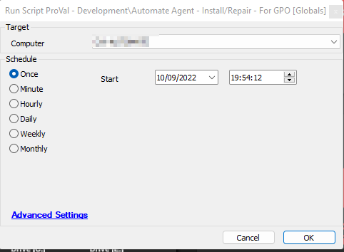
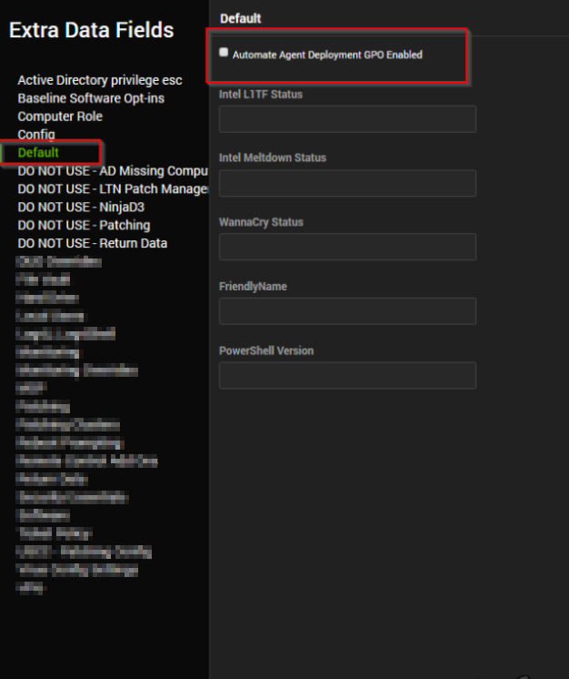
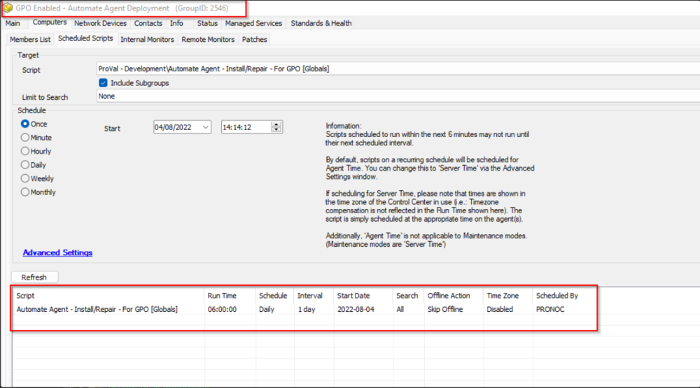

## Summary

The purpose of the script is to create the PowerShell script to be used along with the Automate agent deployment GPO. Also, it will keep the PowerShell Script up-to-date with a new Installation Token. 

The PowerShell script generated will install the agent if missing, attempt to repair the agent if broken, and rip and replace the agent if another MSP's agent is installed.  

Intended Target: Domain Controllers with Automate agent deployment GPO

## Sample Run

## Implementation

Step 1: Create a computer-level EDF "Automate Agent Deployment GPO Enabled".

Step 2: Create an Auto-Join Group for the machines where the EDF is checked. 

Step 3: Schedule the script to run once per day against the group. 

Step 4: Now mark the EDF of the Domain Controllers where you would like to create the Agent Deployment GPO.

## Variables

| Name               | Description                                                                                     |
|--------------------|-------------------------------------------------------------------------------------------------|
| TargetLocationID   | Locationid to create the Installer Token for. Will use the locationid of the computer.        |
| ValidityPeriod     | Age limit for the Installer. 1 Day                                                             |
| InstallerTypeID    | Id of the installer type. 1 represents an .msi agent installer                                 |
| TokenReason        | Reason behind creating the installer token.                                                    |
| TokenIngredients    | Required variables/values to create the Agent token.                                          |
| VerificationKey    | Verification Key for the Agent Installer Token.                                                |
| OutCome            | Output of the PowerShell script used to write/modify the agent installation ps1 file.        |
| InstallerToken     | Installer Token generated to used with the agent reinstall command.                            |

#### Global Parameters

| Name        | Example                                   | Required | Description                       |
|-------------|-------------------------------------------|----------|-----------------------------------|
| Directory   | C:/ProgramData/_Automation/Automate Agent | True     | Path to create the .ps1 script    |
| FileName    | Redo-Agent.ps1                           | True     | Name of the .ps1 script           |

#### Script States

| Name            | Example                                | Description                                                                                       |
|-----------------|----------------------------------------|---------------------------------------------------------------------------------------------------|
| GPO Agent Token  | f9e7246ae89145e98cd8376d93e247aa      | Used to store the currently generated agent token, so that it can be removed before generating another token |

## Process

- Remove the previously generated token for the computer from the `installertokens` table.
- Clear the 'GPO Agent Token' script state.
- Create the @Directory@ if not exists.
- Generate an Agent Installer Token.
- Stores the token to the Script State.
- Generate the PowerShell script on the computer.
- Verifies the Presence of the @InstallerToken@ in the script.
- Logs the outcome.

## Output

- Script State
- Script Log
- Local File on the computer (C:/ProgamData/_Automation/Automate Agent/Redo-Agent.ps1)

## Creating Automate Agent Deployment GPO

\<iframe src="https://proval.itglue.com/attachments/10110714?preview=1" width="100%" height="900px" frameborder="0">\</iframe>

