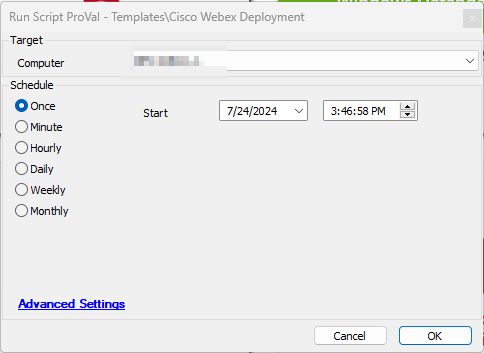

## Summary

This script installs user based Cisco Webex on windows machines.

## Sample Run

## Output

- Script Logs
- Tickets

**Subject:** `Webex Installation Failed for %ClientName%/%ComputerName% at %LocationName%`

**Body:** `Failed to install Webex. Command Result: %shellresult%`

If the Installer fails to get the download:
`Failed to download Webex installer. Please ensure that the following download URL is reachable from the computer: [https://binaries.webex.com/Webex-Desktop-Windows-x64-Combined-Gold/WebexBundle_en.msi](https://binaries.webex.com/Webex-Desktop-Windows-x64-Combined-Gold/WebexBundle_en.msi)`

