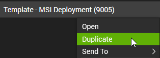
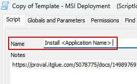
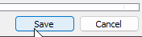
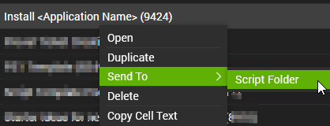
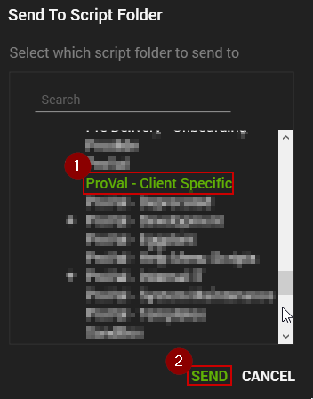
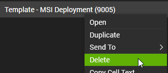
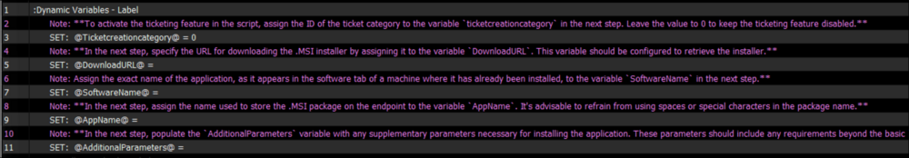
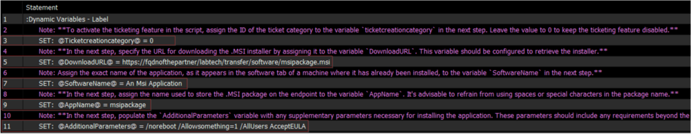

This document is crafted to walk you through the utilization of the `Template - MSI Deployment` for creating a software installation script that employs a .msi file for the installation process.

## Steps

1. Export the `Template - MSI Deployment` script from our environment and import it to the client environment.

2. Right-click on the script and select Duplicate.  
   

3. Rename the copied script to something pertaining to what you are installing, as shown below:  
     
   

4. Right-click the newly renamed software install script and select Send To → Script Folder → Send to the 'ProVal - Client Specific' folder.  
     
   

5. Delete the template script from the environment to ensure we do not have any issues with the script getting updated and replacing the modifications done.  
   

6. Figure out the complete command to silently deploy the application.

7. Determine the precise application name by inspecting the Software tab on the computer where it is currently installed.

8. Verify the authenticity of the download URL for the application. The download URL may either be the custom link generated to retrieve a file from LTShare or the direct download link for the .msi package.

9. Set the required values in the Dynamic Properties of the script.  
     

   - `ticketcreationcategory`: **(Step 3)**: This is used to set an ID for a ticket category, which is necessary to activate the ticketing system for any failures. Setting it to 0 will disable the ticketing feature of the script.
   - `DownloadURL`: **(Step 5)**: This is the URL from which the .msi package can be downloaded.
   - `SoftwareName`: **(Step 7)**: This is the exact name of the application as it appears in the software tab of a machine where it has already been installed.
   - `AppName`: **(Step 9)**: This is the name used to store the .msi package on the endpoint. It’s recommended to avoid spaces or special characters in the package name.
   - `AdditionalParameters`: **(Step 11)**: These are the extra parameters required to install the script, apart from the `msiexec /qn /i \"<Package Path.msi>\"`. For example, if the complete command to install an application named ABC is `msiexec /qn /i \"C://Temp//ABC.msi\" /noreboot ACCEPTEULA`, then `/noreboot ACCEPTEULA` should be stored in this variable.

## Example

Let’s consider a scenario where one of our partners, referred to as `The Partners`, has asked us to develop a script for installing an application that utilizes a .msi package for deployment.

The application is known as `An Msi Application`, a name you discovered from the `Software Tab` on a computer where it’s already installed.

`The Partners` have stored the file in their LTShare, specifically in the `Transfer/Software` directory, and it’s named `msipackage.msi`.

With this information at hand, we are now equipped to deploy the application. So, it’s time to construct the script.

1. Copy the script titled `Template - MSI Deployment` located in the `ProVal - Templates` folder. Rename the copied script to `Deploy An Msi Application`.

2. Generate the download URL to download the installer. That would be [`https://fqdnofthepartner/labtech/transfer/software/msipackage.msi`](https://fqdnofthepartner/labtech/transfer/software/msipackage.msi) in this case. Ensure that the download URL can download the `msipackage.msi` file.

3. Figure out the complete installation command for the `msipackage.msi` package. Let's say the command needed to install the application is `msiexec /qn /i \"msipackage.msi\" /noreboot /Allowsomething=1 /AllUsers AcceptEULA`.

4. Now we have all the values to configure the Global Variables.

5. Set the Dynamic Variables.  
   **TicketCategory**: Leave this variable as `0`, since we do not have any information on whether the partner expects a failure ticket or not.  
   **DownloadURL**: [`https://fqdnofthepartner/labtech/transfer/software/msipackage.msi`](https://fqdnofthepartner/labtech/transfer/software/msipackage.msi)  
   **SoftwareName**: `An Msi Application`  
   **AppName**: `msipackage`  
   **AdditionalParameters**: `/noreboot /Allowsomething=1 /AllUsers AcceptEULA`  
     
   **You do not need to convert the symbols. The conversion portrayed in the screenshot is performed by Automate itself.**

6. Save the script and test it.

7. After the script is prepared, please verify with the partner or consultant whether they would like the script to also generate a ticket in case of failure. If needed, assign the appropriate ticket category ID to the `ticketcreationcategory` variable.

