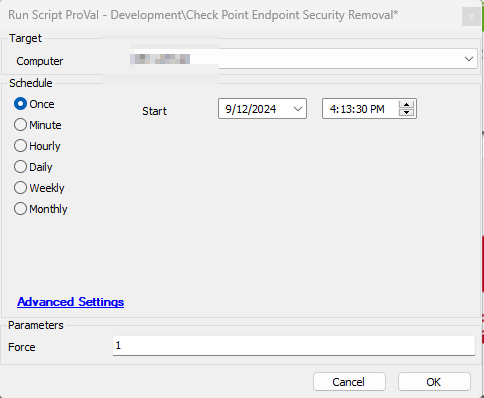

## Summary

This script uninstalls Check Point Endpoint Security from Windows machines. It decrypts the drives if they are encrypted and then proceeds with the Check Point uninstallation. During this process, the machine requires at least two reboots: once for decryption and once to remove Check Point.

**Note:** Use this script with caution as it tends to reboot the machine several times to complete the uninstallation.

## Sample Run

### Global Parameters

| Name                    | Example | Required | Description                                                                                                                                                      |
|-------------------------|---------|----------|------------------------------------------------------------------------------------------------------------------------------------------------------------------|
| TicketCreationCategory   | 126     | False    | Set it to '0' to disable ticketing. Specify the ticket creation category to direct the tickets to the right board and enable ticket creation.                  |

### User Parameters

| Name   | Example | Required | Description                                                                                                                                                                                                                      |
|--------|---------|----------|----------------------------------------------------------------------------------------------------------------------------------------------------------------------------------------------------------------------------------|
| Force  | 1       | True     | Set it to '1' to confirm the reboot of the machine. If it's not set to '1' and the machine is online, the script will not proceed with the uninstallation, as it requires several reboots for completion.                           |

### Extra Data Fields

| EDF Name                | Level  | Type  | Description                                                                                                      |
|-------------------------|--------|-------|------------------------------------------------------------------------------------------------------------------|
| Uninstallation Password  | Client | Text  | Populate the Uninstallation Password required to uninstall Check Point from the machine.                        |

## Output

- Script Logs
- Ticketing

## Ticketing

Tickets will only be generated if the ticket category is defined on a global monitor.

**Ticket Subject:** `Check Point Endpoint Security uninstallation failed on %ComputerName% (%ComputerID%)`

**Ticket Body:** `Check Point Endpoint Security uninstallation failed on %ComputerName% (%ComputerID%)`

The PC information is outlined below:  
PC Name: %computername%  
Last Login: %lastuser%  
PC Model: @biosname@  
OS: %os%  
S/N of PC: @biosver@  

