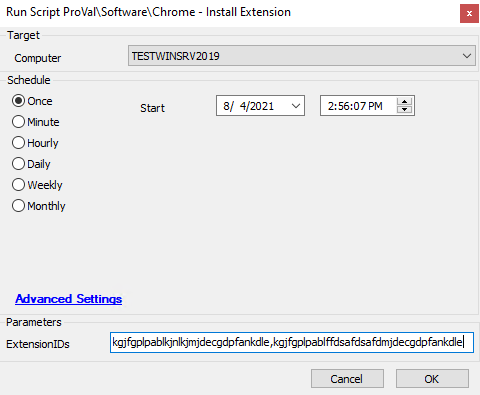

## Summary

This script is used to enforce the installation of an extension or a list of extensions in Google Chrome.

**Time Saved by Automation:** 5 Minutes

## Sample Run

## Dependencies

- [Register-ChromeExtension](https://proval.itglue.com/DOC-5078775-7267407)

## Variables

- `@PS1Path@` -> This is the location of the PowerShell payload.
- `@PS1Log@` -> The location of the log from the PowerShell script.

#### User Parameters

| Name        | Example                                   | Required | Description                                              |
|-------------|-------------------------------------------|----------|----------------------------------------------------------|
| ExtensionID | kgjfgplpablkjnlkjmjdecgdpfankdle        | True     | This is the extension ID based on the Chrome Web Store. |

## Process

1. The script downloads a PS1 file locally on the target machine.
2. Runs the PowerShell script and installs the plugin on Chrome.
3. Verifies the script ran successfully based on the PowerShell script logs.
4. Logs the success/failure to Automate's script logs.

## Output

- Script log
- Local file on the computer
