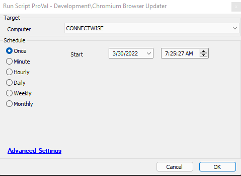

## Summary

This script addresses recent Chromium CVEs.

It executes the same update command as used in Windows Task Scheduler to update the following Chromium-based browsers:

- Google Chrome
- Microsoft Edge
- Brave
- Opera

Ticketing is optional if the global parameter is set to a ticket category above 0.

## Sample Run

## Dependencies

Suggested for use as an Autofix - [CWM - Software - Monitor - ProVal - Chromium Browser Outdated [G]](<../monitors/ProVal - Chromium Browser Outdated G.md>)

#### Global Parameters

| Name                    | Example | Required | Description                                                             |
|-------------------------|---------|----------|-------------------------------------------------------------------------|
| ticketcreationcategory   | 123     | True     | Defaults to 0; if set above 0, it will trigger ticket creation on script failure. |

## Process

1. Gathers the current maximum version for the noted browsers.
2. Executes the same command as Windows Task Scheduler to update the browser.  
   Example: *"C:/Program Files (x86)/Microsoft/EdgeUpdate/MicrosoftEdgeUpdate.exe" /ua /installsource scheduler*
3. Resends software to the Automate server and performs basic checks for a new version number, along with optional ticketing for failures.

## Output

- Script log
- Optional ticketing

