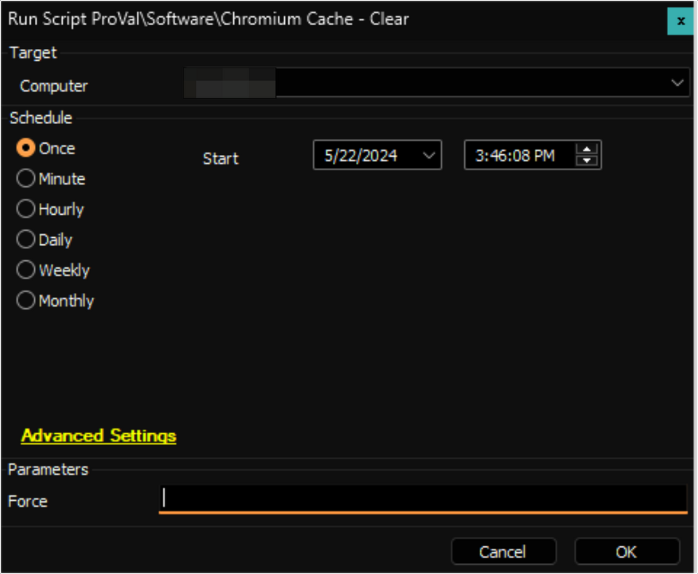

## Summary

This is the Automate implementation of the agnostic script [SWM - Software Configuration - Script - Clear-ChromiumCache](https://proval.itglue.com/DOC-5078775-10371996).

## Sample Run

#### User Parameters

| Name   | Example | Required | Description                                                                                                                                                     |
|--------|---------|----------|-----------------------------------------------------------------------------------------------------------------------------------------------------------------|
| Force  | 1       | False    | Browser instances will be terminated if the `Force` parameter is set to `1` and they are bearing a handle to target cache files.                             |

## Output

- Script log

