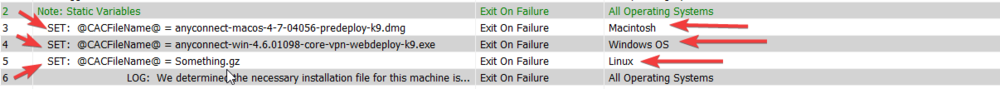
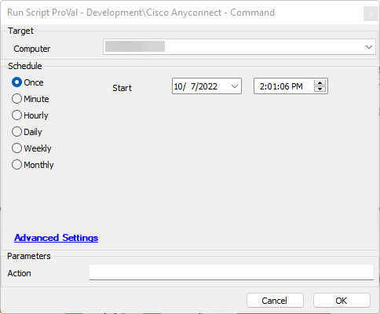
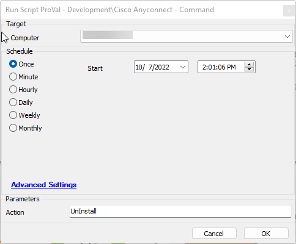

## Summary

This script will uninstall or install Cisco AnyConnect depending on the user parameter provided. It is designed to work on Windows machines, Mac machines, and potentially Linux machines (untested).

This script requires the download of the Windows, Mac, and Linux installation media from the client portal. Please avoid renaming the downloaded files, as it may break the Linux implementation. Once those files are obtained, place them in the `Ltshare/transfer/installers/360UW/Cisco-AnyConnect/` folder. Then open the script and change the static variables to match your downloaded files, paying specific attention to the designated operating system for each variable.

Save the script.

## Sample Run

The default action of this script is to install Cisco AnyConnect.

Only providing 'UnInstall' in the action parameter will trigger the uninstall.

## Variables

Document the various variables in the script. Delete any section that is not relevant to your script.

| Name            | Description                                                                                                                                                                        |
|-----------------|------------------------------------------------------------------------------------------------------------------------------------------------------------------------------------|
| CACFileName     | This is a static variable set in the static variables section of the script. These files must be set to the machine type filenames you placed in the `Ltshare/transfer/installers/360UW/Cisco-AnyConnect/` folder for each operating system. Lines 3, 4, and 5 in the script. |
| CACFileNoGz     | This removes the .gz from the CACFileName so we can navigate into the folder to install the package.                                                                               |
| MountedName      | This is the mounted name of the drive when installing on Mac devices.                                                                                                          |
| UnmountedName    | This is the unmounted name of the drive when installing on Mac devices.                                                                                                        |

#### User Parameters

| Name    | Example                             | Required | Description                                                                                              |
|---------|-------------------------------------|----------|----------------------------------------------------------------------------------------------------------|
| Action  | This can be anything or 'UnInstall' | False    | This determines the action to take regarding Cisco AnyConnect, either to install or uninstall. The default is to install Cisco AnyConnect. |

## Process

### Action

1. Install
   1. Check if Cisco AnyConnect is installed; if it is, exit.
   2. Download the required file.
   3. Check that the file downloaded; if it did not, log an error and exit.
   4. Determine the method of installation
      1. Windows
         - Install the application.
      2. Mac
         1. Mount the DMG file.
         2. Get the drive name.
         3. Install the application.
         4. Unmount the drive.
      3. Linux
         1. Unzip the GZ file.
         2. Determine the assumed path.
         3. Install the application.
   5. Check if Cisco AnyConnect is installed; if it's not, exit with an error.

2. Uninstall
   1. Check if Cisco AnyConnect is installed; if it's not, exit.
   2. Execute the uninstall command determined by the OS.
   3. Check if Cisco AnyConnect is installed; if it's still not, exit with an error.

## Output

- Script log
  - There is extensive script logging in this script for both the install and uninstall processes.

