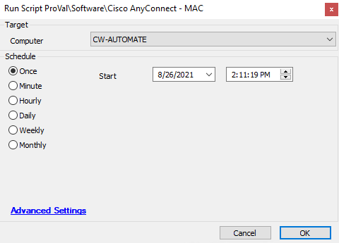

## Summary

This script will install the Cisco Anyconnect application on Mac agents.

Time Saved by Automation: 10 Minutes

## Sample Run

## Variables

`installers/360UW/Cisco-AnyConnect/anyconnect-macos-4-7-04056-predeploy-k9.dmg` -- This script requires this file to be on LTshare.

| Variable       | Description                                                                 |
|----------------|-----------------------------------------------------------------------------|
| MountedName    | This stores name as join of (/ + %shellresult% (till 2nd value after /) + ',' + /glip.app) |
| UnmountedName  | This stores name as join of (/ + %shellresult% (till 2nd value after /) )   |

## Process

- Downloads the dmg package from the LTShare. (The ltshare should have the file at Labtech/Transfer/installers/360UW/Cisco-AnyConnect/anyconnect-macos-4-7-04056-predeploy-k9.dmg).
- Once the download runs successfully, the script will attempt to install it on MAC agent.
- It will set the Mount and Unmount name for the application and copy and detach application respectively based on Mount/Unmount Name.

## Output

- Script log

