## Summary

An agnostic wrapper for the [Install-Anyconnect agnostic script](https://proval.itglue.com/5078775/docs/11897620).

## Sample Run

- Please review the Client-level EDFs found below. If you intend to install Umbrella or all applications in the package, populate the EDFs with accurate information.
- This is not mandatory; however, it eliminates the need to add additional calls to the Arguments parameter.

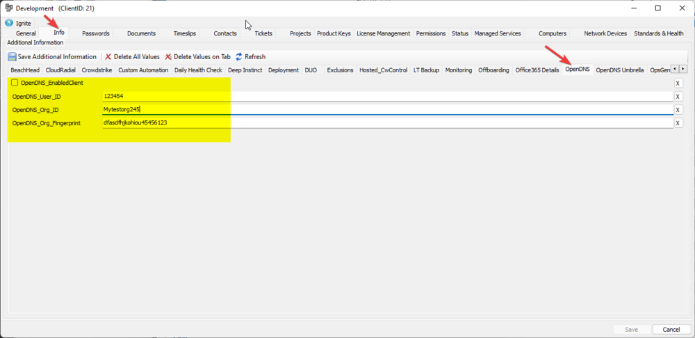

An empty Arguments parameter installs only the core-vpn module.

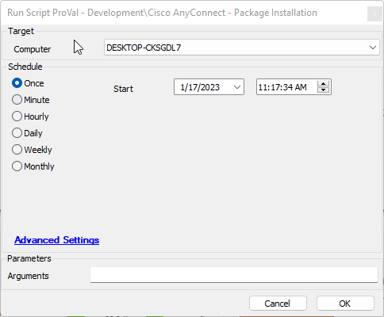

Passing the -All argument will only work if the EDFs above are properly set.

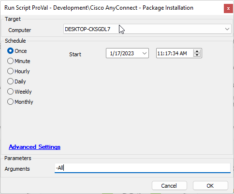

If the above EDFs are not set, you must provide the ClientID, Fingerprint, and OrgID. This applies when running the -Umbrella switch as well.

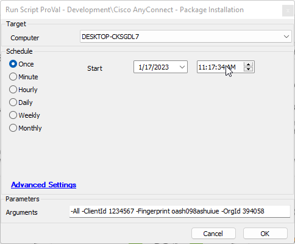

Individual components may also be installed. Please reference the documentation for the [Install-Anyconnect Agnostic Script](https://proval.itglue.com/5078775/docs/11897620).

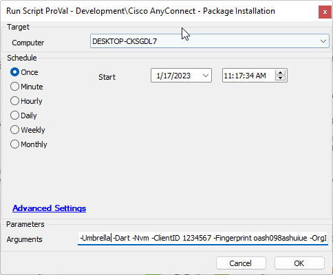

## Dependencies

- [Install-Anyconnect Agnostic Script](https://proval.itglue.com/5078775/docs/11897620)

## Variables

Document the various variables in the script. Delete any section that is not relevant to your script.

| Name        | Description                                  |
|-------------|----------------------------------------------|
| OrgID      | The org ID found in the client-level EDF    |
| Fingerprint | The fingerprint found in the client-level EDF |
| Client      | The client ID found in the client-level EDF  |

### User Parameters

| Name       | Example | Required | Description                                                                                                                                                                                                                   |
|------------|---------|----------|-------------------------------------------------------------------------------------------------------------------------------------------------------------------------------------------------------------------------------|
| Arguments  | -All    | False    | The arguments to pass to the underlying script. Note: Passing -All or -Umbrella requires either the client-level EDF values above to be set or three additional parameters to be passed: -ClientID, -OrgID, and -Fingerprint. Please review the [Install-Anyconnect Agnostic Script](https://proval.itglue.com/5078775/docs/11897620) document for more information on these parameters. |

## Output

- Script log

## Module Definitions

### Core-VPN

- Core-VPN must be installed with any additional module.
- All modules require that Core-VPN be installed.
- When only installing Core-VPN, you can expect to see the following.

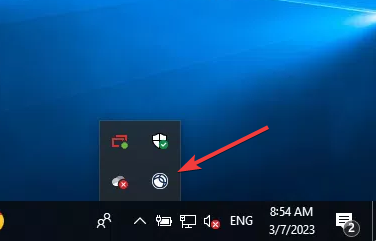 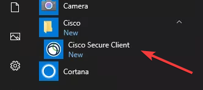  
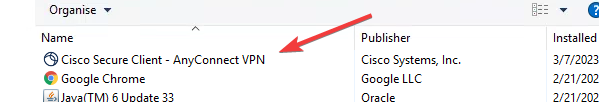 

### SBL

- SBL stands for Start Before Login; it adds no direct user GUI; however, it does add an entry into programs and features.
- It enables the execution of the AnyConnect VPN prior to a user being logged in.

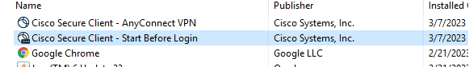

### DART

- DART stands for Diagnostics and Reporting Tool.
- When installing this, you can expect to see the following items.

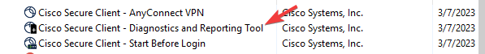   
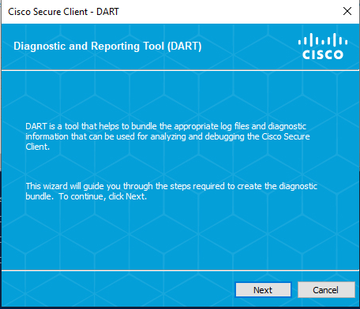

### NAM

- NAM stands for Network Access Manager.
- When installing this module, you can expect to see the following items.

 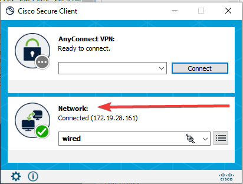

### NVM

- NVM stands for Network Visibility Manager.
- Network Visibility Manager does not include a GUI but does the following:
  - Network Visibility Manager **helps you see user and endpoint behavior both on and off premises**. It collects standard flows from endpoints (laptops, for example) along with context like user, application, device, location, and destination information.

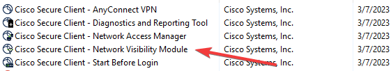

### Posture

- Posture provides the Cisco AnyConnect Secure Mobility Client with the ability to assess an endpoint's compliance for things like antivirus, antispyware, and firewall software installed on the host.
- It does not provide a user GUI.

### IsePosture

- IsePosture provides the Cisco AnyConnect Secure Mobility Client with the ability to assess an endpoint's compliance for things like antivirus, antispyware, and firewall software installed on the host, with a user GUI interface.
- When installing this module, you can expect to see the following:

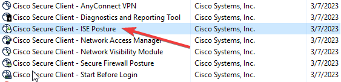 

### Umbrella

- Umbrella installs the Cisco Umbrella module.
- When installing this module, you can expect to see the following:

 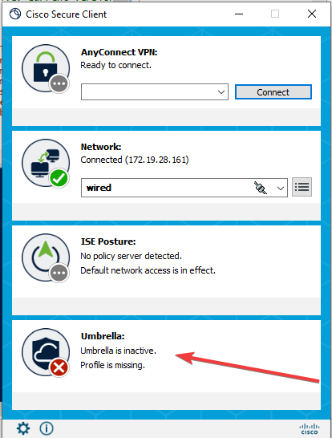

## Uninstalling

- When uninstalling this package, you can simply uninstall the Core-VPN module, and it will remove all embedded modules except for the DART module; that module will have to be removed separately.

## FAQ

- Will this installation update older versions of Cisco AnyConnect?
  - Yes, each requested component will be updated if run against a machine that has that component already installed. Components that are not requested will not be updated.

