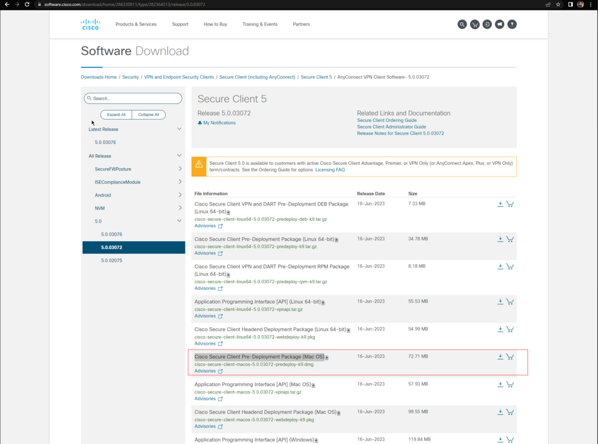
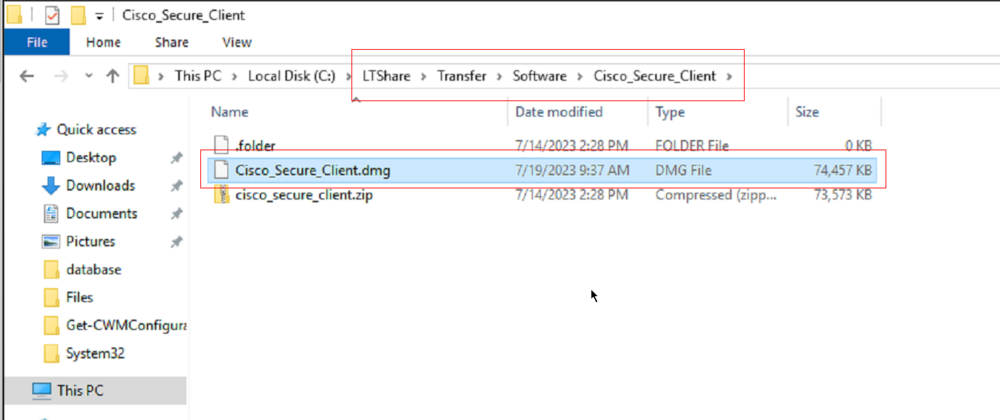
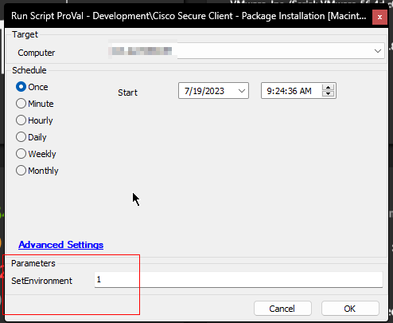
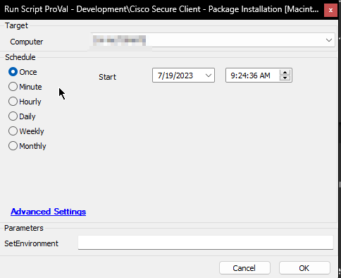
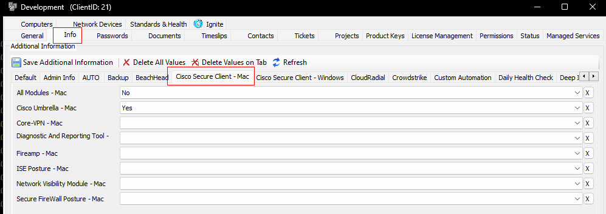
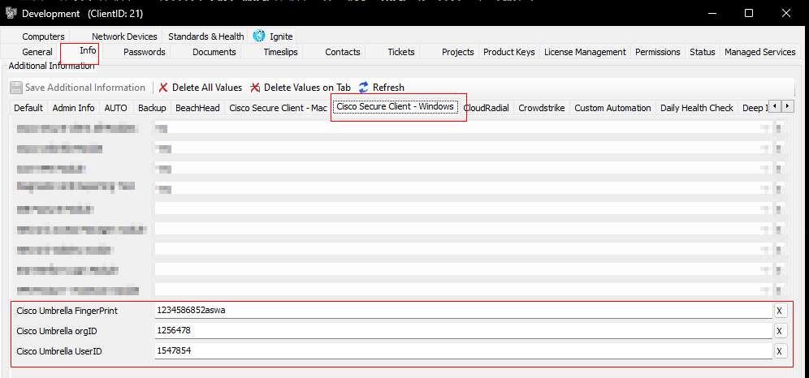
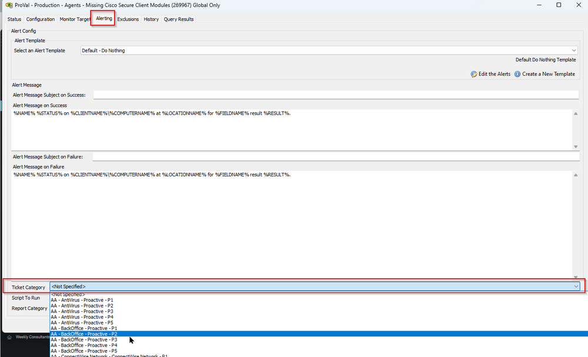
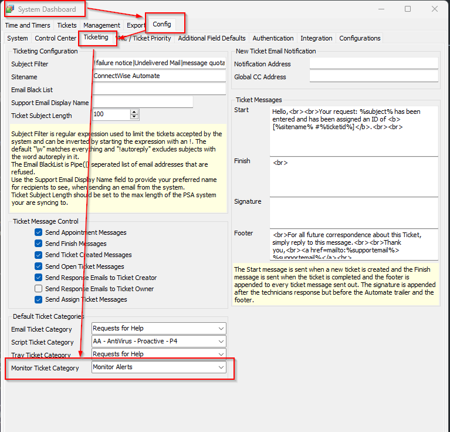

## Summary

Provides an option to install different Cisco Secure Client modules on a MAC machine.

**Requirement:** MySQL 8.0+

## Prerequisite

Download the `Cisco Secure Client Pre-Deployment Package (Mac OS)` and place it in LTShare (WebDAV for hosted partners) at `LTShare/Transfer/Software/Cisco_Secure_Client` as `Cisco_Secure_Client.dmg`.

The file can be downloaded from [https://software.cisco.com/download/home/286330811/type/282364313/release/5.0.03072](https://software.cisco.com/download/home/286330811/type/282364313/release/5.0.03072). Cisco changes this download URL for each release. Prefer downloading the latest stable version of the tool.



If the `Cisco_Secure_Client` Directory does not exist in `LTShare/Transfer/Software`, then create the directory and place the downloaded zip file in the directory as `Cisco_Secure_Client.dmg`.



To use the script, you must put the file with the specified name in the mentioned directory.

## Sample Run

- For the initial execution of the script, it is essential to set the user parameter `SetEnvironment` to 1. This step is necessary to create the mandatory EDFs (Extra Data Fields) required for the script's execution.
  
  

- To deploy the application:
  
  

## Variables

| Name      | Description                                                                                     |
|-----------|-------------------------------------------------------------------------------------------------|
| Parameter | Parameter to pass to the installation script for installing the modules.                       |

## Global Variables

| Name                      | Default                                                                                                           | Required | Description                                                                                                                                                                                                                                                                                                                                                                                                                                                                 |
|---------------------------|-------------------------------------------------------------------------------------------------------------------|----------|-----------------------------------------------------------------------------------------------------------------------------------------------------------------------------------------------------------------------------------------------------------------------------------------------------------------------------------------------------------------------------------------------------------------------------------------------------------------------------|
| DownloadURL               | [https://redirhostname/labtech/transfer/software/cisco_secure_client/cisco_secure_client.dmg](https://redirhostname/labtech/transfer/software/cisco_secure_client/cisco_secure_client.dmg) | True     | Download URL to download the `Cisco_Secure_Client.dmg` file from LTShare. Download URL should not be changed unless the installer cannot be placed in the LTshare and another download URL is available to download the installer.                                                                                                                                                                                                                       |
| Ticket_On_Failure         | 0                                                                                                                 | False    | Set it to '1' to receive tickets in case the script fails to install the application.                                                                                                                                                                                                                                                                                                                                                                                      |

## User Parameters

| Name           | Example | Required                              | Description                                                                                                                                                                                                                                                                                                                                                                       |
|----------------|---------|---------------------------------------|-----------------------------------------------------------------------------------------------------------------------------------------------------------------------------------------------------------------------------------------------------------------------------------------------------------------------------------------------------------------------------------|
| SetEnvironment  | 1       | True (For First Execution Only.)      | For the initial execution of the script, it is essential to set the user parameter `SetEnvironment` to 1. This step is necessary to create the mandatory EDFs (Extra Data Fields) required for the script's execution.                                                                                                                                                             |

## EDFs

These client-level dropdown EDFs, which offer a **`yes/no`** option for installing the corresponding module, must be configured beforehand. These EDFs play a crucial role in the script's functionality and must be set appropriately.

| Name                                 | Level  | Type      | Example  | Description                                                                                                                                                                                                                                                 |
|--------------------------------------|--------|-----------|----------|-------------------------------------------------------------------------------------------------------------------------------------------------------------------------------------------------------------------------------------------------------------|
| All Modules - Mac                    | Client | DropDown  | Yes/No   | Select `Yes` to deploy/install all available modules on the client's computers. Select `No` or leave it blank to ignore the EDF.                                                                                                                        |
| Cisco Umbrella - Mac                 | Client | DropDown  | Yes/No   | Select `Yes` to deploy/install Cisco Umbrella module on the client's computers. Select `No` or leave it blank to disable the Module's deployment.                                                                                                         |
| Core-VPN - Mac                       | Client | DropDown  | Yes/No   | Select `Yes` to deploy/install Cisco Secure Client - AnyConnect VPN module on the client's computers. Select `No` or leave it blank to disable the Module's deployment.                                                                                     |
| Diagnostic And Reporting Tool - Mac  | Client | DropDown  | Yes/No   | Select `Yes` to deploy/install Diagnostic And Reporting Tool module on the client's computers. Select `No` or leave it blank to disable the Module's deployment.                                                                                           |
| Fireamp - Mac                        | Client | DropDown  | Yes/No   | Select `Yes` to deploy/install Fireamp module on the client's computers. Select `No` or leave it blank to disable the Module's deployment.                                                                                                                 |
| ISE Posture - Mac                    | Client | DropDown  | Yes/No   | Select `Yes` to deploy/install ISE Posture module on the client's computers. Select `No` or leave it blank to disable the Module's deployment.                                                                                                             |
| Network Visibility Module - Mac      | Client | DropDown  | Yes/No   | Select `Yes` to deploy/install Network Visibility module on the client's computers. Select `No` or leave it blank to disable the Module's deployment.                                                                                                       |
| Secure Firewall Posture - Mac        | Client | DropDown  | Yes/No   | Select `Yes` to deploy/install Cisco Secure Client Firewall Posture Module on the client's computers. Select `No` or leave it blank to disable the Module's deployment.                                                                                     |
| Cisco Umbrella FingerPrint           | Client | TextBox   | ae4871c4fb151e23 | To save the Cisco Umbrella FingerPrint for the client, it can be fetched from OrgInfo.json file. The Json file can be downloaded for each organization from the Cisco Secure Client Portal. It is mandatory to set this EDF to deploy the `Umbrella` module. |
| Cisco Umbrella OrgID                 | Client | TextBox   | 15457482 | To save the Cisco Umbrella OrgID for the client, it can be fetched from OrgInfo.json file. The Json file can be downloaded for each organization from the Cisco Secure Client Portal. It is mandatory to set this EDF to deploy the `Umbrella` module.               |
| Cisco Umbrella UserID                | Client | TextBox   | 1254852  | To save the Cisco Umbrella UserID for the client, it can be fetched from OrgInfo.json file. The Json file can be downloaded for each organization from the Cisco Secure Client Portal. It is mandatory to set this EDF to deploy the `Umbrella` module.              |
| Exclude from Cisco Secure Client - Mac | Computer | Checkbox | -        | Select it to exclude the machine from Cisco Secure Client Deployment.                                                                                                                                                                                                                                               |

**Modules EDF:**



**Keys EDF:**



**Note:**
- If you are setting `Yes` for `All Modules - Mac`, then the script will attempt to install all the available modules regardless of the selection for the individual module.
- It is mandatory to set the `Cisco Umbrella FingerPrint`, `Cisco Umbrella OrgID`, and `Cisco Umbrella UserID` if any of `All Modules - Mac` and `Cisco Umbrella - Mac` is selected `yes` for installation.
- Choosing `Cisco Umbrella Module` will automatically install `Core-VPN Module` since it is must required to install umbrella module.

## Output

- Script log
- Ticketing

## Ticketing

**Subject:**  `Cisco Secure Client Installation Failed on %ComputerName%(%ComputerID%)`

**Possible Ticket Summary/Comments:**

**If script fails to install the application:**
```
Failed to deploy the application. Here are the installation results:
%shellresult%

The PC information is outlined below:
PC Name: %computername%
Last Login: %lastuser%
PC model: @biosname@
OS: %os%
S/N OF PC: @biosver@
```

**If application is installed successfully but needs a reboot:**
```
Application installed successfully but a reboot is needed to validate the installation of some module(s).
```

**If Automate fails to write script on the machine:**
```
Automate was unable to write the installation script on the computer.
```

## TicketCategory

The ticket category for the tickets generated by the script can be set at the following levels:

- On global monitor set. The ticket category can be selected at the monitor set ([ProVal - Production - Agents - Missing Cisco Secure Client Modules](<../monitors/Last Cumulative Update  75 Days ago.md>)).
  
  

- If ticket category is not set on the monitor, the ticket will be generated under the default ticket category.
  
  

## FAQ

- Will this installation update older versions of Cisco AnyConnect?
  - Yes, each requested component will be updated if run against a machine that has that component already installed. Components that are not requested will not be updated.


