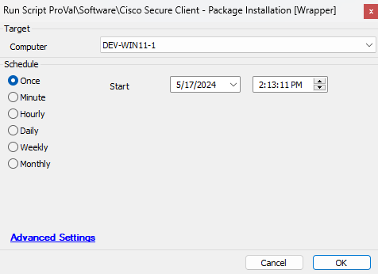

## Summary

This is a wrapper script that executes the [Script - Cisco Secure Client - Package Installation [Windows]](https://proval.itglue.com/DOC-5078775-13366604) for Windows machines and the [Script - Cisco Secure Client - Package Installation [Macintosh]](https://proval.itglue.com/DOC-5078775-13393960) for Mac machines. It was designed to be used as an autofix with [CWA - Internal Monitor - Missing Cisco Secure Client Modules](https://proval.itglue.com/DOC-5078775-15949763).

## Sample Run

