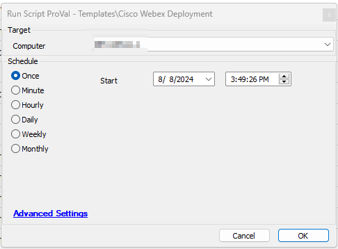

## Summary

This script installs User Based Cisco Webex on Windows Machines.

## Sample Run

## Output

- Script Logs
- Tickets

## Ticketing

The tickets will be generated only if TicketCreationCategory value is greater than 0. Make sure to use the correct ticketcreationcategory in order to direct the tickets to the right board.

Subject: `Cisco Webex Installation Failed for %ClientName%/%ComputerName% at %LocationName%`

Ticket Body: `Failed to install Cisco Webex.  Command Result: %shellresult% `

when script fails to download the installer

`Failed to download Cisco Webex installer. Please ensure that the following download URL is reachable from the computer:  [https://binaries.webex.com/WebexTeamsDesktop-Windows-Gold/Webex.msi](https://binaries.webex.com/WebexTeamsDesktop-Windows-Gold/Webex.msi) `

