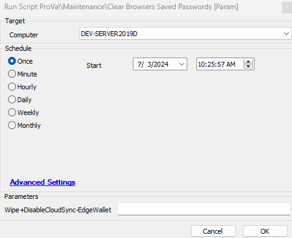
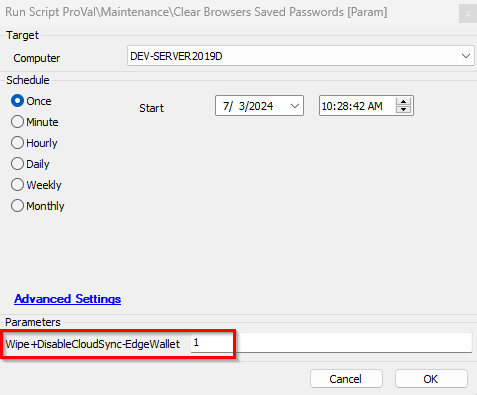

## Summary

The script is designed to remove saved passwords from the following browsers:

- Google Chrome
- Microsoft Edge
- Edge Wallet (Optional)
- Brave
- Mozilla Firefox

**Note:** If any of these browsers run, they will be forcefully closed.

## Sample Run

Run with a parameter set to 1, to wipe out the Microsoft Edge Wallet passwords and disable the cloud sync of the Edge Wallet so that passwords don't sync back from the cloud.

## Output

- Script Log

