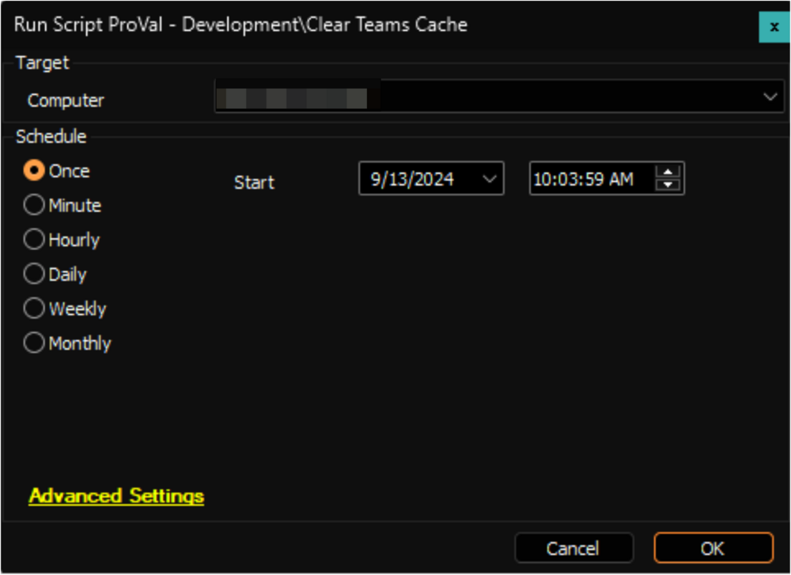

## Summary

The script clears the Cache for installed Microsoft Teams on the Windows Machines.

**Caution:** The script will forcibly terminate Microsoft Teams if running, and the application must be restarted manually afterwards.

## Sample Run

## Output

- Script log

