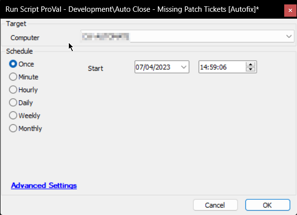

## Summary

The purpose of the script is to finish the new/open tickets created by the Missing Patches detection solution for the machines missing less than three or not missing any patches.

Affected Ticket Subject: `UPDATES - 3 Patches Missing on %ClientName%//%ComputerName%`

## Sample Run

## Dependencies

[CWM - Internal Monitor - ProVal - Client Specific - Auto Close - Missing Patch Tickets](https://proval.itglue.com/DOC-5078775-12589460)

## Variables

| Name        | Description                                      |
|-------------|--------------------------------------------------|
| STATUS      | Status returned by the monitor set (FAILED/SUCCESS) |
| Count       | Number of tickets to finish                       |
| SQLTicketid | Ticketid to finish/close                         |

