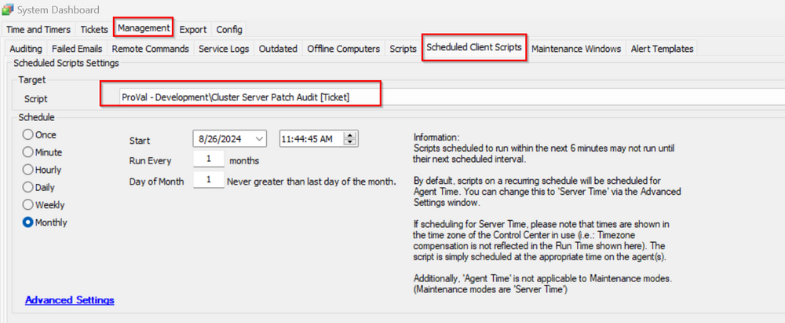

## Summary

This client script will create a ticket for all the cluster hosts where the currently installed Cumulative Update shows older than 60 days in the [Table - pvl_win_latest_installed_cu](<../tables/pvl_win_latest_installed_cu.md>).

## Sample Run

## Dependencies

[Table - pvl_win_latest_installed_cu](<../tables/pvl_win_latest_installed_cu.md>)

## Output

- Ticket
- Script log

## Ticketing

**Subject:**  
UPDATES - Cluster Server Patching for @ServerCount@ Servers at @sqlname@

**Body:**  
There are @ServerCount@ server(s) at @sqlname@ that are in need of manual patching, since Automate is not recommended to patch clusters. Please manually patch the machine(s) listed below:

%sqlresult%

Thank You!

