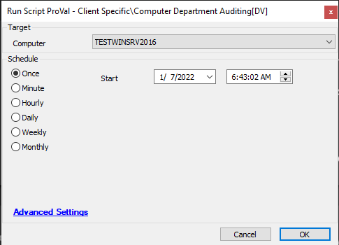

## Summary

This script collects the AD Users department information.

## Sample Run

## Dependencies

[plugin_proval_computer_department](<../../unsorted/plugin_proval_computer_department.md>)  
@Department Detail of AD Users [Script] -- Dataviews  
@Department Detail of Computer [Script] -- Dataviews  

## Process

This script will collect the user department information of the AD Users.  
It will store the information to the table `plugin_proval_computer_department` and also store the value to the EDF "Computer Department".

## Output

- Script log
- Table `plugin_proval_computer_department`
- Dataview
- etc.

