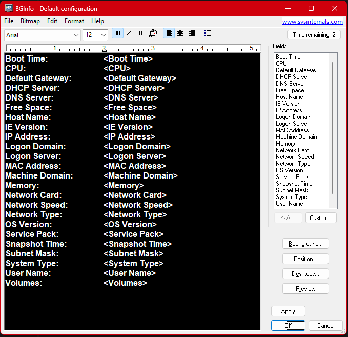
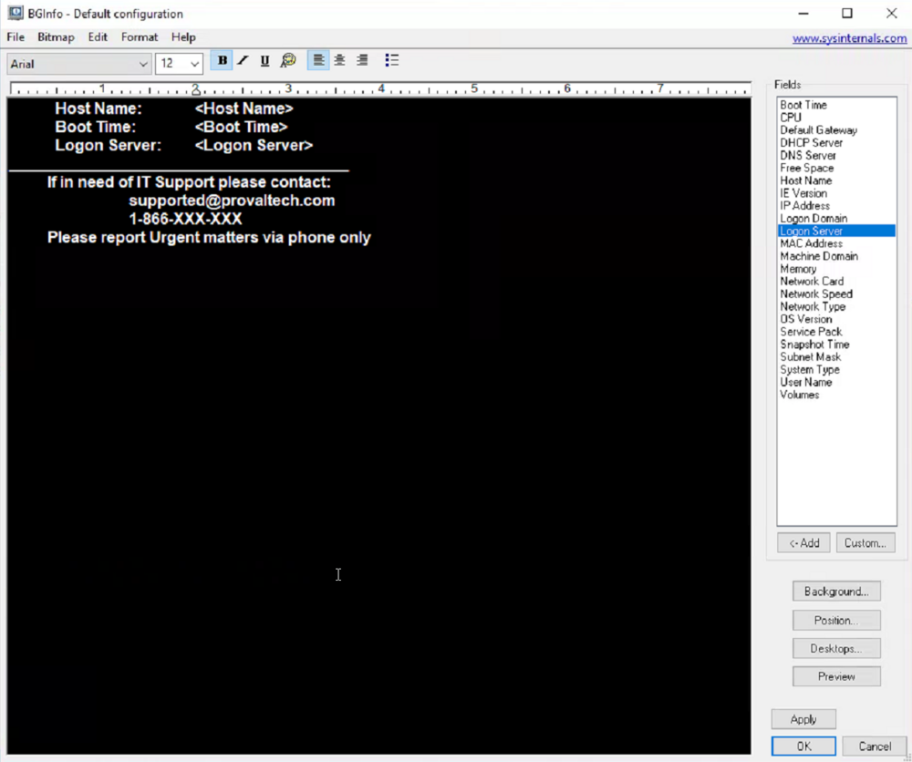
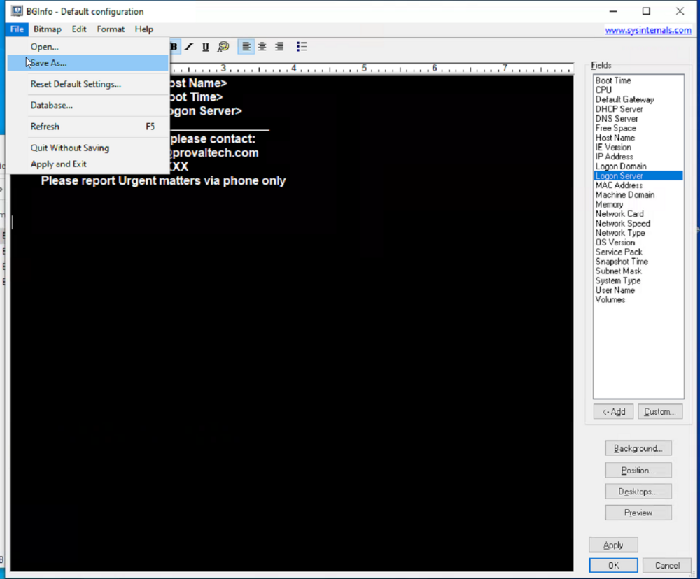
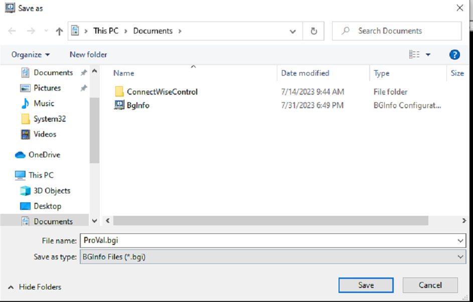
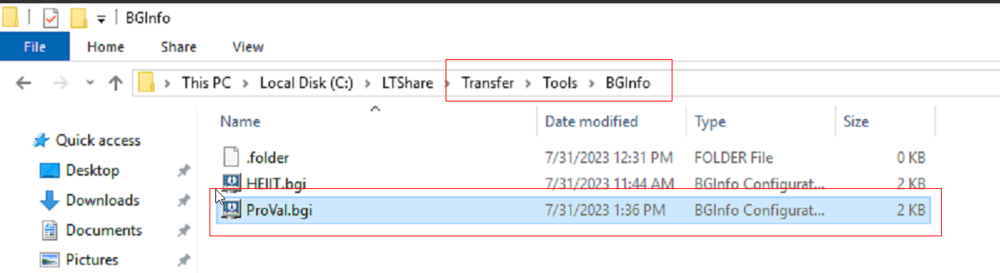
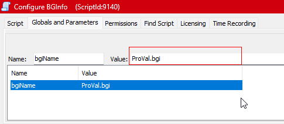
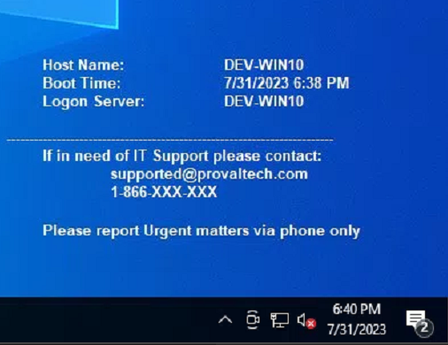
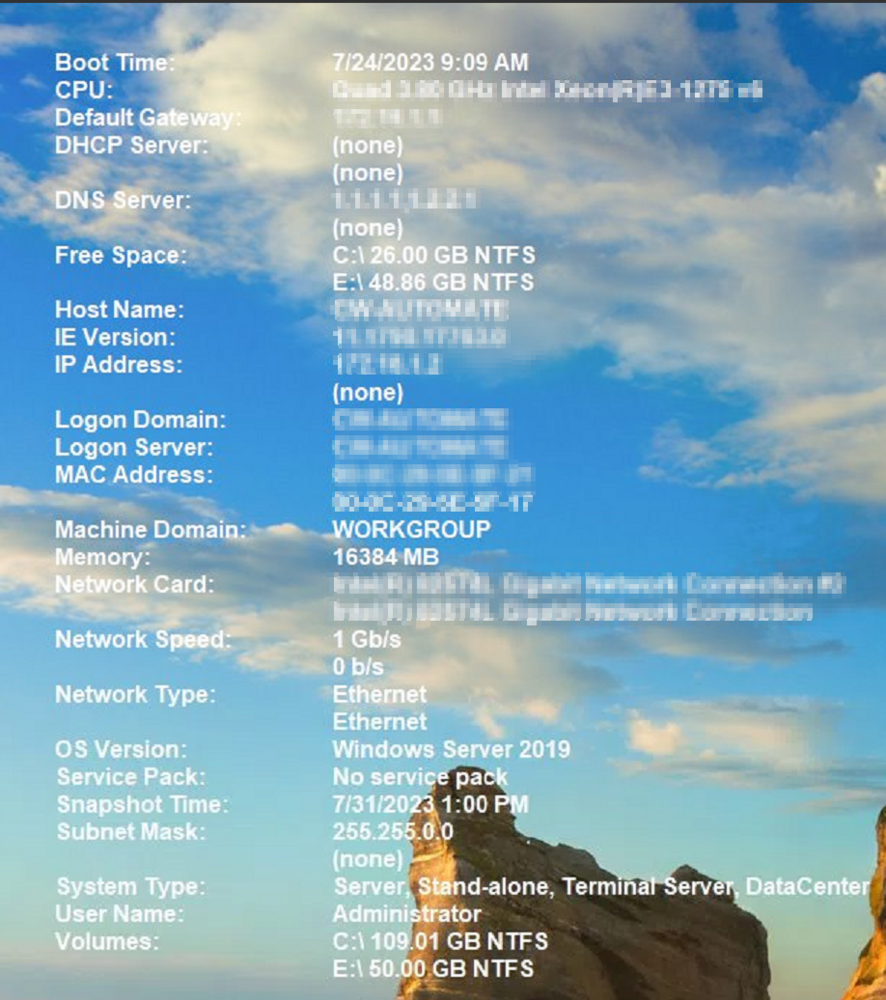
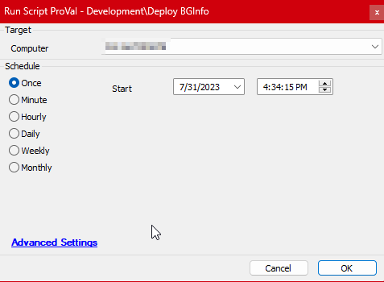

## Summary

The purpose of the script is to download and configure the [BGInfo](https://learn.microsoft.com/en-us/sysinternals/downloads/bginfo) tool with the proper `.bgi` configuration file. `.bgi` file should be placed in the LTshare (WebDAV for hosted partners) at the `Transfer\Tools\BGInfo` directory, and the name of the file should be set in the Script's Global variable `bgiName`.

**Note:** The end machine might need to be restarted for the changes to take place.

## File Hash

**File Path:** `C:\ProgramData\_automation\Script\Deploy-BGinfo\Deploy-BGInfo.ps1`  
**File Hash (Sha256):** `2186E9DD322B29592686BF6F48A21E116187752AD5A748E40987F6C20B677A34`  
**File Hash (MD5):** `666A8A1AA66FE746EF224083BA52A737`

## Implementation

### Step 1  
Download the BGInfo.zip file to your computer from [Download BGInfo](https://download.sysinternals.com/files/BGInfo.zip).

### Step 2  
Expand the Zip file and run the `BGInfo.exe` file. This is how it will look, you can clear the contents on the left window and can write your own configuration.  

### Step 3  
Write the required configuration to display on the user's desktop.  

### Step 4  
Once your configuration file is written, Click on File option at the top right and Select `Save As`.  

### Step 5  
Save the file with an appropriate name and .bgi extension. Try avoiding spaces and special characters in the file name.  

### Step 6  
Now save the file in LTShare (WebDAV for hosted partners) at the `Transfer\Tools\BGInfo` directory. Create the Tools and BGInfo directory if missing.  

### Step 7  
Open the script and save the exact name of the file under the global variable `bginame`.  

### Step 8  
Save and test the script.  

The conguration file I have saved in the example screenshots will display the following information at the end machine.  

  

**Note:** If the global variable `bgiName` is not set in the script then running the script will display the default information at user's desktop.  
  

## Sample Run  

 

## Variables  

| Name            | Description                                                                                           |
|-----------------|-------------------------------------------------------------------------------------------------------|
| Status          | FAILED/SUCCESS, returned by the EPM - Software Configuration - Remote Monitor - Configure BGInfo monitor set. |
| bgiURL          | URL to download .bgi configuration file from LTShare/WebDAV.                                          |
| Parameter       | Parameter to pass while running the PowerShell script configuring the tool on the end machine.        |
| ProjectName     | Deploy-BGInfo                                                                                         |
| WorkingDirectory| C:\ProgramData\_Automation\Script\Deploy-BGinfo                                                        |

## Global Variables  

| Name    | Example    | Required | Description                                                                                                      |
|---------|------------|----------|------------------------------------------------------------------------------------------------------------------|
| bgiName | proval.bgi | False    | Name of the .bgi configuration file generated and saved in LTShare. The tool will display the default information at the user's desktop if this variable is left blank/unconfigured. | 

## Output  

- Script Log
