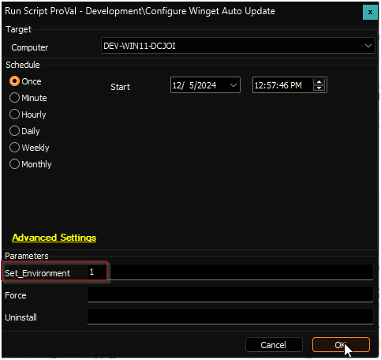
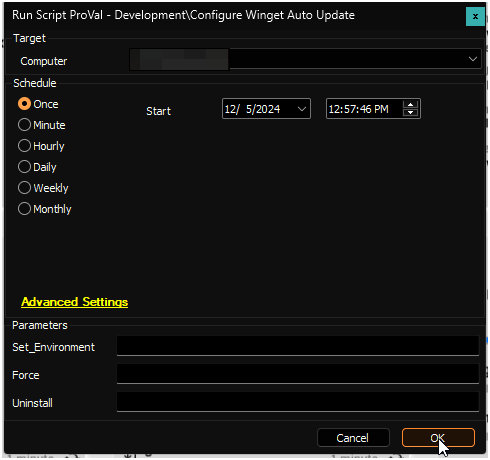
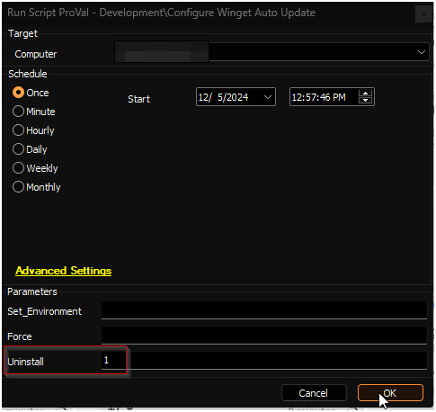
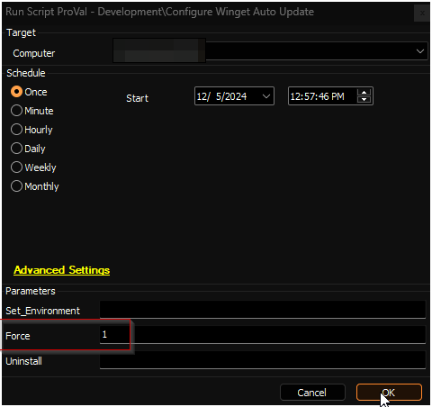
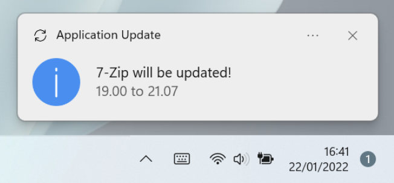
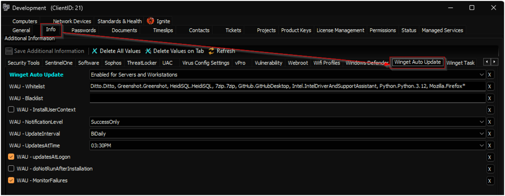

## Summary

The script configures the [Winget-AutoUpdate](https://github.com/Romanitho/Winget-AutoUpdate) solution on the endpoint with the options configured in the client-level EDFs, which are further explained in this document. Additionally, it can create the [Winget Auto Update Errors](<../monitors/Winget Auto Update Errors.md>) remote monitor if the client-level EDF `WAU - MonitorFailures` is flagged.

Refer to [Winget-AutoUpdate](https://github.com/Romanitho/Winget-AutoUpdate) for detailed information on `Winget-AutoUpdate`.

## File Hash

**File Path:** `C:/ProgramData/_Automation/script/Winget-AutoUpdate/Winget-AutoUpdate.ps1`  
**File Hash (Sha256):** `DCC8DF84B0145829B31B89BA047A786C42189C4598C4C458E7D575D7DC1985EF`  
**File Hash (MD5):** `07DFAD0A66AA5A4B40C946DF727BE3D8`

## Additional PowerShell Scripts

These scripts come with the `Winget-AutoUpdate` application.

| File Name                       | File Path                                                                                       | File Hash (Sha256)                                                                                     | File Hash (MD5)               |
|---------------------------------|-------------------------------------------------------------------------------------------------|--------------------------------------------------------------------------------------------------------|-------------------------------|
| Winget-AutoUpdate-Install.ps1   | C:/ProgramData/_Automation/script/Winget-AutoUpdate/WAU/Winget-AutoUpdate-Install.ps1       | 738F3E3F01B3DB0B5AB25EE6B586E632B1044DA18E1C7DBCDA45AB88B28827A0                                   | 954A877ACD5B74F8568DAC23C74DF9A2 |
| User-Run.ps1                    | C:/ProgramData/_Automation/script/Winget-AutoUpdate/WAU/Winget-AutoUpdate/User-Run.ps1      | DC6919D7B7001EC56122100B3B633F459F6F49981565D580B41E536DE9B0113E                                   | C1C532D865420357E25BA3D4D1B6E950 |
| WAU-Policies.ps1                | C:/ProgramData/_Automation/script/Winget-AutoUpdate/WAU/Winget-AutoUpdate/WAU-Policies.ps1  | 0F0D076F23B3FE1ABB4A144BB9A6A413E195D30B40C71C4D558EC1064704B2D3                                   | 9342DE82642AD1977FD4B4A522EA70F8 |
| WAU-Uninstall.ps1               | C:/ProgramData/_Automation/script/Winget-AutoUpdate/WAU/Winget-AutoUpdate/WAU-Uninstall.ps1 | C64BBA059115E2E8F7BA754ADEF5300617C42F18F6DEB9A6670A74468E2DD6CD                                   | 40BE78A0706D3A20F4CAC1AE5526B10B |
| Winget-Install.ps1              | C:/ProgramData/_Automation/script/Winget-AutoUpdate/WAU/Winget-AutoUpdate/Winget-Install.ps1 | C69CC71BF2E67A585816ECE253F4E13799A73CF79DCEB5653072CA538C4975ED                                   | 4287AFB7F2FE5703F372B1533E73E2CA |
| Winget-Notify.ps1               | C:/ProgramData/_Automation/script/Winget-AutoUpdate/WAU/Winget-AutoUpdate/Winget-Notify.ps1  | BC004D7C794EE6921948ED2191F00CF0CF936B207C9802F6AAEC744D8C172894                                   | E60F4DAA89B899D238A7330A2FF25D2B |
| Winget-Upgrade.ps1              | C:/ProgramData/_Automation/script/Winget-AutoUpdate/WAU/Winget-AutoUpdate/Winget-Upgrade.ps1  | 8D2E82B266A104FB63C84BEF19AEC1BCB3C70CFD7156770F48BFB1F8A50A0FD2                                   | E613D2A2F3411BF52D41CF79153F9403 |
| Add-ScopeMachine.ps1            | C:/ProgramData/_Automation/script/Winget-AutoUpdate/WAU/Winget-AutoUpdate/functions/Add-ScopeMachine.ps1 | 8D3E0CE90AC6AE720B17E16D02061D16C5F501626A56A48930740BE6AB14C311                                   | BB8EA83AA87ABE5F2BB2A50DA9079352 |
| Add-Shortcut.ps1                | C:/ProgramData/_Automation/script/Winget-AutoUpdate/WAU/Winget-AutoUpdate/functions/Add-Shortcut.ps1 | 2EEE5655448AFBABB4E378F542AFA9C858A8B24FCCD6D6C05FA1BEA9B9F3FCFB                                   | 6457B8ABD9DD8FA42EC57D2F09B706C1 |
| Confirm-Installation.ps1        | C:/ProgramData/_Automation/script/Winget-AutoUpdate/WAU/Winget-AutoUpdate/functions/Confirm-Installation.ps1 | 145C6B2B56476219055BBB76AD2A21F0B77C6E038EE0483BB5EF2D50EC486B95                                   | 96CF71D860AA13A4798BBF81B752620F |
| Get-AppInfo.ps1                 | C:/ProgramData/_Automation/script/Winget-AutoUpdate/WAU/Winget-AutoUpdate/functions/Get-AppInfo.ps1 | D2628CA9E5F62D1633628BB4E0A2F4F0A80316E7D01923E269576E259FA6E5ED                                   | FC551FEF084728BF59067B870936F146 |
| Get-AZCopy.ps1                  | C:/ProgramData/_Automation/script/Winget-AutoUpdate/WAU/Winget-AutoUpdate/functions/Get-AZCopy.ps1 | AB3A6C4A75A5317EBDEDC9FB12F3CE4EC72F8EFC138EB6269A4AF9B6D498A10D                                   | BF33295523FB2B00B83512A80A6274C3 |
| Get-ExcludedApps.ps1            | C:/ProgramData/_Automation/script/Winget-AutoUpdate/WAU/Winget-AutoUpdate/functions/Get-ExcludedApps.ps1 | 240B02F21C8E0F38F5A5D783F836B6E948E7D41AEA48C3986806DF38D0B36D9D                                   | 15B468591CF13B35DAE6999CC6F234E8 |
| Get-IncludedApps.ps1            | C:/ProgramData/_Automation/script/Winget-AutoUpdate/WAU/Winget-AutoUpdate/functions/Get-IncludedApps.ps1 | B846DA38B50C384E52AC07FB348B17C10DA23CBFBA00FC511A8F5ECA1A3CEDC6                                   | 3B6E65F6C0865EF01D8162F09D92901C |
| Get-NotifLocale.ps1             | C:/ProgramData/_Automation/script/Winget-AutoUpdate/WAU/Winget-AutoUpdate/functions/Get-NotifLocale.ps1 | 5B73331CBBD8D54D07706C6D2EF336613C6D544E3FE95D77A3343219D79A8675                                   | 7BACDABBA3770B62F42984E861B6666F |
| Get-WAUAvailableVersion.ps1     | C:/ProgramData/_Automation/script/Winget-AutoUpdate/WAU/Winget-AutoUpdate/functions/Get-WAUAvailableVersion.ps1 | 21D507C942C504D1D2B3F0B9F1E72A3CA3CA5F60425DFEC19D2C0152574BA2BB                                   | 56B024E6EDCFEFF95E414ECB40C4F69A |
| Get-WAUConfig.ps1               | C:/ProgramData/_Automation/script/Winget-AutoUpdate/WAU/Winget-AutoUpdate/functions/Get-WAUConfig.ps1 | DF1E099969F7FF666BECF93EEE3F1CC358655E3BFA6DD9649262EB864A8E6C3F                                   | 983692CCA31B77CF68DF285B061EFA47 |
| Get-WingetCmd.ps1               | C:/ProgramData/_Automation/script/Winget-AutoUpdate/WAU/Winget-AutoUpdate/functions/Get-WingetCmd.ps1 | A5346A0F02B3E0FF25745069F0781558B4C05E7D725799C4E2320EF34E83B28C                                   | 2E6E1AEDCF3B09A533E857CAD5D7E5B1 |
| Get-WingetOutdatedApps.ps1      | C:/ProgramData/_Automation/script/Winget-AutoUpdate/WAU/Winget-AutoUpdate/functions/Get-WingetOutdatedApps.ps1 | 4B0475588D9D98ADBF2C658A978C78162220D0C1BB8AF3F82043E1E5663E6717                                   | 7770132470A84CF4CA75BD551B880445 |
| Get-WingetSystemApps.ps1        | C:/ProgramData/_Automation/script/Winget-AutoUpdate/WAU/Winget-AutoUpdate/functions/Get-WingetSystemApps.ps1 | 53B0A97C1EA945B11CCE442306EF8648F2E8181543838EB7A7348DB370F705E9                                   | 747053AFBC29738A2D90EBB53BCE4B5E |
| Install-Prerequisites.ps1       | C:/ProgramData/_Automation/script/Winget-AutoUpdate/WAU/Winget-AutoUpdate/functions/Install-Prerequisites.ps1 | 3CC059BF73A6DFCB8FB55916572F4A342759B6E79D0CBFAF0E675DE874EE2569                                   | A0683E9655D5AE46ED60CB2162066479 |
| Invoke-DirProtect.ps1           | C:/ProgramData/_Automation/script/Winget-AutoUpdate/WAU/Winget-AutoUpdate/functions/Invoke-DirProtect.ps1 | D3EE093A8170768EB66E8D2E4A74365D224BE9FA23FBD5BE32744706A096489E                                   | 31DC76A2EF8C77E0957B8C27A26082E7 |
| Invoke-LogRotation.ps1          | C:/ProgramData/_Automation/script/Winget-AutoUpdate/WAU/Winget-AutoUpdate/functions/Invoke-LogRotation.ps1 | 76687123B6A596B70130AD0A7C26EA3CB44C8CFDBD1B35F07A78B582D183B77D                                   | D20DCCD10D5975CA072FEED3CC65A621 |
| Invoke-PostUpdateActions.ps1    | C:/ProgramData/_Automation/script/Winget-AutoUpdate/WAU/Winget-AutoUpdate/functions/Invoke-PostUpdateActions.ps1 | E7AF3A0EBB8BDD90762B1789D9770E7E255421A9C0357BB8CE3523991C51359D                                   | BCFE9FEA7509641C319FD1BDD0365C59 |
| Start-NotifTask.ps1             | C:/ProgramData/_Automation/script/Winget-AutoUpdate/WAU/Winget-AutoUpdate/functions/Start-NotifTask.ps1 | 1EA695807F5942A1D5F91B6063C8A78A002B815284FC46E60B4E07BED46C6797                                   | 50613337BDE967FCF2C3D2CC20A89FC0 |
| Test-ListPath.ps1               | C:/ProgramData/_Automation/script/Winget-AutoUpdate/WAU/Winget-AutoUpdate/functions/Test-ListPath.ps1 | 08AD9C30410CA1E1AAD9176716A65CCA6B00AB4D2933A9CAAEEE6640E5247092                                   | C71B0DBA7B64840BDBE58E5513E10FF0 |
| Test-Mods.ps1                   | C:/ProgramData/_Automation/script/Winget-AutoUpdate/WAU/Winget-AutoUpdate/functions/Test-Mods.ps1 | DDB00054A80C7A88B02F567ACB908448AD04FD4CF1A5A8AC93C720F91C9CF2AF                                   | FC078BDB3A10E6BBD32392F5CCF37221 |
| Test-ModsPath.ps1               | C:/ProgramData/_Automation/script/Winget-AutoUpdate/WAU/Winget-AutoUpdate/functions/Test-ModsPath.ps1 | 2FDA731587D5874450CFA98C91F23898E1DA5878E8F3F98FB24D42800EC29DE8                                   | 8312EE1C82CD195DFCE80989D2A65693 |
| Test-Network.ps1                | C:/ProgramData/_Automation/script/Winget-AutoUpdate/WAU/Winget-AutoUpdate/functions/Test-Network.ps1 | 8709FE84E00A3562CC7C3BF4CEE328B368A487ADA11AEFE5E04B6A951296384A                                   | 0B558BEDFF5D70E72C99EE83DCBE1063 |
| Test-PendingReboot.ps1          | C:/ProgramData/_Automation/script/Winget-AutoUpdate/WAU/Winget-AutoUpdate/functions/Test-PendingReboot.ps1 | 17A4C671984998883167D72DEC318AA26E0283866A82877B2F707F9397E83729                                   | 52CEA880EB082C533ECEF87734CC5100 |
| Update-App.ps1                  | C:/ProgramData/_Automation/script/Winget-AutoUpdate/WAU/Winget-AutoUpdate/functions/Update-App.ps1 | 4BBFC55A0289EC873867DA2BB702508845CAC7F364AEE9EEEB5553E9F45B6D28                                   | 92E7625FCA538A1DBC6F592E1FBAC688 |
| Update-StoreApps.ps1            | C:/ProgramData/_Automation/script/Winget-AutoUpdate/WAU/Winget-AutoUpdate/functions/Update-StoreApps.ps1 | 1BCAEAC7A71EACEF438E5D0D8C55AFF61F1F4B43182684A2B5A63C970683DF15                                   | EFC4332F655B864C1AF65884967137AD |
| Update-WAU.ps1                  | C:/ProgramData/_Automation/script/Winget-AutoUpdate/WAU/Winget-AutoUpdate/functions/Update-WAU.ps1 | 804C815464FDFBE170234275F4BE807019A08DD51E9BB774EEED7C71D7B574A5                                   | EF3B6B21FDD240507A696AA9479FD496 |
| Update-WinGet.ps1               | C:/ProgramData/_Automation/script/Winget-AutoUpdate/WAU/Winget-AutoUpdate/functions/Update-WinGet.ps1 | E0D20CF1C2C4D122D11194BB99812E66F288BD524DFA65B9A7E3AA1596FE7750                                   | F03CD8B2C064559E2EA86381F51E7133 |
| Write-ToLog.ps1                 | C:/ProgramData/_Automation/script/Winget-AutoUpdate/WAU/Winget-AutoUpdate/functions/Write-ToLog.ps1 | 996721F33BEE9F45CCD0211C5C33A76767DE7701834BDB4C4F42C69560BA5FFB                                   | C1EE84D531DA16BFB7C49DD0E33D678F |
| _AppID-template.ps1             | C:/ProgramData/_Automation/script/Winget-AutoUpdate/WAU/Winget-AutoUpdate/mods/_AppID-template.ps1 | EF411BCFB4406F55A9E1834F2805732B0F99E8C68F8F17B7FD6A083A3DC0C73E                                   | 9309BCADA879230E21F34FEE1951F98D |
| _Mods-Functions.ps1             | C:/ProgramData/_Automation/script/Winget-AutoUpdate/WAU/Winget-AutoUpdate/mods/_Mods-Functions.ps1 | 5B742B2E5B66D4EC499F5042056FA0D30776F1395B3EF54DD297F5686D533D0E                                   | 7DFBF0C755DA8D1464FA568F71D525CB |
| _WAU-mods-template.ps1          | C:/ProgramData/_Automation/script/Winget-AutoUpdate/WAU/Winget-AutoUpdate/mods/_WAU-mods-template.ps1 | 463672E1C075F2CF16A4287FBDBED599E0EA9CBFEB8F5609B4720892B6A57033                                   | A90551361927EB09E0D0585D09B1E9DD |
| _WAU-notinstalled-template.ps1   | C:/ProgramData/_Automation/script/Winget-AutoUpdate/WAU/Winget-AutoUpdate/mods/_WAU-notinstalled-template.ps1 | E22F344CDB5AF727202DC5FC4413871F04300DDA063C99EC8A4BA97FA3A840DB                                   | 2B289A8EF8BA15EFFD7736945DE0C3A3 |
| User-Run.ps1                    | C:/ProgramData/_Automation/script/Winget-AutoUpdate/Winget-AutoUpdate/User-Run.ps1          | 39A94BB08FB0B0E473872919329AFB57C7DB5F43734DCEC4AB3DD74A6F356E30                                   | D27460131DA5B3290F2D6EEA804A4DA2 |
| WAU-Installer-GUI.ps1           | C:/ProgramData/_Automation/script/Winget-AutoUpdate/Winget-AutoUpdate/WAU-Installer-GUI.ps1 | 8A582CDA4CDFDAF6A96F1A33F96D2CB2A6396A8974048BFFEFFD9C3B641E300D                                   | 0D6967B3FB4518F32DEF04825AC0849C |
| WAU-Notify.ps1                  | C:/ProgramData/_Automation/script/Winget-AutoUpdate/Winget-AutoUpdate/WAU-Notify.ps1        | 977833F729766FB877E9FBFB12D2BDD2EEA44F2FF0361F9C82590B7FD4C719F7                                   | 3CF82FDFA743F72827DBF00EBFE20BFD |
| WAU-Policies.ps1                | C:/ProgramData/_Automation/script/Winget-AutoUpdate/Winget-AutoUpdate/WAU-Policies.ps1      | 175AABF509C07D9FBEA3D7044606266B6CCE4CDA3D49DD4023C8432772B48EE5                                   | EB02ED037E8BC4C82FD586E125CCDBD1 |
| Winget-Install.ps1              | C:/ProgramData/_Automation/script/Winget-AutoUpdate/Winget-AutoUpdate/Winget-Install.ps1    | 09BDE37B4DF1031DACD53B5CA893F22EDD7E05320BE9FE8E45C944BCBB21E2AE                                   | D007A0736E60E0C4D5CEDD26D7D19986 |
| Winget-Upgrade.ps1              | C:/ProgramData/_Automation/script/Winget-AutoUpdate/Winget-AutoUpdate/Winget-Upgrade.ps1    | A8F8811E934E81EC531E0D5F9D5193639BAD69D0C24445DA631BAE9F127B9721                                   | 9DF44CA961D6F0CF0162E39031BF82A4 |

## Sample Run

**First Run:** Run the script with the `Set_Environment` parameter set to `1` for the first run to create the [pvl_wau_config](<../../unsorted/SWM - Software Update - Custom Table - pvl_wau_config.md>) table and EDFs used by the solution.

**Regular Execution:**  

To uninstall `Winget-AutoUpdate` and wipe its traces, it will remove the [Winget Auto Update Errors](<../monitors/Winget Auto Update Errors.md>) remote monitor if it exists. Additionally, the Computer-level EDF `Exclude From Winget Auto Update` will be flagged, resulting in excluding the computer from the solution and preventing the script execution in the future.  

The script's default nature is to compare the existing configuration before running the installation. Setting the `Force` to `1` will skip the comparison.  

## Dependencies

[https://github.com/Romanitho/Winget-AutoUpdate](https://github.com/Romanitho/Winget-AutoUpdate)  
[SWM - Software Update - Internal Monitor - Execute Script - Configure Winget Auto Update](<../monitors/Execute Script - Configure Winget Auto Update.md>)

## Variables

| Name              | Description                                        |
|-------------------|----------------------------------------------------|
| projectName       | Winget-AutoUpdate                                 |
| workingDirectory   | C:/ProgramData/_automation/script/Winget-AutoUpdate |
| ps1Path           | C:/ProgramData/_automation/script/Winget-AutoUpdate/Winget-AutoUpdate.ps1 |

## User Parameters

| Name                | Example | Required                        | Description                                                                                                                                                                                                                                    |
|---------------------|---------|---------------------------------|------------------------------------------------------------------------------------------------------------------------------------------------------------------------------------------------------------------------------------------------|
| Set_Environment      | 1       | True (for first execution)     | Run the script with the `Set_Environment` parameter set to `1` for the first run to create the [pvl_wau_config](<../../unsorted/SWM - Software Update - Custom Table - pvl_wau_config.md>) table and EDFs used by the solution.                                      |
| Force                | 1       | False                           | The script's default nature is to compare the existing configuration before running the installation. Setting the `Force` to `1` will skip the comparison.                                                                                          |
| Uninstall            | 1       | False                           | To uninstall `Winget-AutoUpdate` and wipe its traces. It will remove the [Winget Auto Update Errors](<../monitors/Winget Auto Update Errors.md>) remote monitor if it exists. Additionally, the Computer-level EDF `Exclude From Winget Auto Update` will be flagged, resulting in excluding the computer from the solution and preventing the script execution in the future. |

## Client-Level EDF

| Name                       | Example                                                  | Type      | Dropdown Options                                                                                                           | Description                                                                                           |
|----------------------------|----------------------------------------------------------|-----------|---------------------------------------------------------------------------------------------------------------------------|-------------------------------------------------------------------------------------------------------|
| Winget Auto Update          | Enabled for Servers and Workstations                     | Dropdown  | - Disabled - Enabled for Workstations Only - Enabled for Servers and Workstations                                    | Set this EDF to enable the Winget Auto Update solution.                                              |
| WAU - Whitelist            | Ditto.Ditto, Greenshot.Greenshot, HeidiSQL.HeidiSQL... | Text      |                                                                                                                           | A comma-separated list of applications to update. By default, the solution will enable the Auto-update for all applications unless a whitelist is defined. Specifying this list overrides the blacklisted applications. |
| WAU-Blacklist              | Ditto.Ditto, Greenshot.Greenshot, HeidiSQL.HeidiSQL... | Text      |                                                                                                                           | A comma-separated list of applications to exclude. Only one of Whitelist or Blacklist can be used at a time. If both are provided, Whitelist will take precedence. |
| WAU - InstallUserContext   |                                                          | Check-Box |                                                                                                                           | Flag this EDF to enable auto-update for User-level applications, too. By default, only system-level applications are updated.  **Note:** End users may observe a PowerShell window appearing on their screens during the scheduled update if the user context is enabled. |
| WAU - NotificationLevel     | SuccessOnly                                             | Dropdown  | - Full - SuccessOnly - None                                                                                          | Specifies the notification level for application updates.  **Default:** None  **Sample Notification:**  |
| WAU - UpdateInterval       | Daily                                                    | Dropdown  | - Daily - BiDaily - Weekly - BiWeekly - Monthly - Never                                                     | Specifies the frequency of updates for the applications. This EDF defines how frequently the available updates are checked and implemented for the applications.  **Default:** Daily |
| WAU - UpdatesAtTime        | 06AM                                                    | Dropdown  | - 12AM - 12:30AM - 01AM - 01:30AM - 02AM - 02:30AM - 03AM - 03:30AM - 04AM - 04:30AM - 05AM - 05:30AM - 06AM - 06:30AM - 07AM - 07:30AM - 08AM - 08:30AM - 09AM - 09:30AM - 10AM - 10:30AM - 11AM - 11:30AM - 12PM - 12:30PM - 01PM - 01:30PM - 02PM - 02:30PM - 03PM - 03:30PM - 04PM - 04:30PM - 05PM - 05:30PM - 06PM - 06:30PM - 07PM - 07:30PM - 08PM - 08:30PM - 09PM - 09:30PM - 10PM - 10:30PM - 11PM - 11:30PM | Specifies the time for updates in 12-hour format for updating the applications.  **Default:** 06AM |
| WAU - updatesAtLogon      |                                                          | Check-Box |                                                                                                                           | Flag this EDF to configure WAU to run at user logon. Both UpdatesAtTime and UpdatesAtLogon can be used together. |
| WAU - doNotRunAfterInstallation |                                                  | Check-Box |                                                                                                                           | Flag this EDF to prevent Winget-AutoUpdate from running immediately after installation. By default, it runs after installation. |
| WAU - MonitorFailures      |                                                          | Check-Box |                                                                                                                           | Flag this EDF to create the [Winget Auto Update Errors](<../monitors/Winget Auto Update Errors.md>) remote monitor on the computer to alert on Winget AutoUpdate failures. |

## Location-Level EDF

| Name                          | Type      | Section    | Description                                                                                      |
|-------------------------------|-----------|------------|--------------------------------------------------------------------------------------------------|
| Exclude From Winget Auto Update | Check-Box | Exclusions | Flag this EDF to exclude the location from the Winget Auto Update solution.                     |

## Computer-Level EDF

| Name                          | Type      | Section    | Description                                                                                      |
|-------------------------------|-----------|------------|--------------------------------------------------------------------------------------------------|
| Exclude From Winget Auto Update | Check-Box | Exclusions | Flag this EDF to exclude the computer from the Winget Auto Update solution.                     |

## Output

- Script logs
- Custom Table 
- Remote Monitor
- Scheduled tasks created under `/WAU/`:
  - Winget-AutoUpdate
  - Winget-AutoUpdate-Notify
  - Winget-AutoUpdate-Policies
  - Winget-AutoUpdate-UserContext

