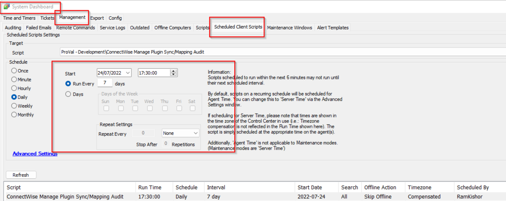

## Summary

This script is intended to email [alerts@provaltech.com](mailto:alerts@provaltech.com) in the event it finds any necessary components as unsynced or unmapped in the CW Manage plugin.

## Sample Run

It is a client script that should be scheduled to run once a week.  

## Dependencies

- CW Manage Plugin

## Variables

| Name    | Description                                                                                           |
|---------|-------------------------------------------------------------------------------------------------------|
| OutCome | Outcome of the SQL query looking for all the unsynced/unmapped components of the CW Manage Plugin   |
| Email   | [alerts@provaltech.com](mailto:alerts@provaltech.com)                                                |
| Subject | Email's subject                                                                                       |
| Body    | Email's body                                                                                          |

## Process

**Step 1:** A SQL query sets the variable `@OutCome@` with the information of all the unsynced/unmapped configurations of the CW Manage plugin. It will contain unsynced clients that are not ignored, unsynced locations that are not ignored, unsynced assets (only workstations and servers), unassigned asset templates, and unmapped ticket statuses and priorities for both CWM to CWA and CWA to CWM.  
**Step 2:** It will not trigger if everything is fine; otherwise, it will generate a ticket in our (ProVal's) Autotask portal.

## Output

- Email

