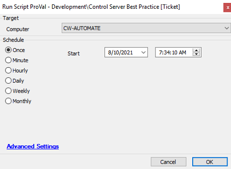

## Summary

This document details the process of auditing and establishing hardening rules and policies based on the recently published CW document [Hardening CW Control (on-prem) Servers](https://proval.itglue.com/5078775/docs/8025398).

**Time Saved by Automation:** 30 Minutes

## Sample Run

## Variables

- `@Admins@`: Name of the local admins.
- `@PrivTicOutput@`: Output of the command `SecEdit /export /cfg $TemplateFilename /areas USER_RIGHTS`.
- `@OpenPorts@`: List of the open ports to be closed.

## Process

> Get the names of users/groups added to the Administrators group and add them to the ticket.  
> Set the following Group Policy Objects (GPOs):  
> - Do Not Allow Anonymous Enumeration of SAM accounts and Shares  
> - Disallow AutoPlay for non-volume devices  
> - Do not execute any autorun commands  
> - Turn off AutoPlay  
> - Always install with elevated privileges  
> Get the names of users/groups acting as Operating System and add them to the ticket.  
> The following ports are checked only if the server is placed in the Domain:  
> - Port 135: MSRPC  
> - Port 139: NetBios  
> - Port 445: Microsoft-ds  
> Disable TLS 1.0 and TLS 1.1  
> **Steps below this line will be executed only if the server has the Windows IIS Server Role detected:**  
> - Disable HTTP Headers  
> - Disable HTTP Options  

[View Document](https://proval.itglue.com/5078775/docs/8025398#version=published&documentMode=view)

## Output

Ticket

