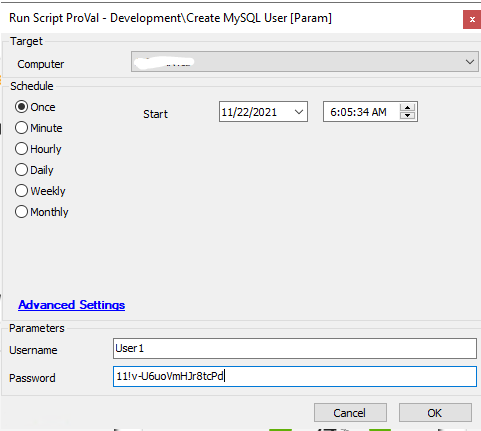

## Summary

This script will create a new MYSQL user with Read-only permissions.

Requirement: CW Automate Version 22 Patch 10 +

## Sample Run

#### User Parameters

| Name     | Example                  | Required | Description                  |
|----------|--------------------------|----------|------------------------------|
| Username | User1                    | True     | New MYSQL username.          |
| Password | 11!v-U6uoVmHJr8tcPd     | True     | New MYSQL user password.     |

## Process

This script runs a SQL query and creates a new MYSQL user with Full permissions for `Labtech` database.

