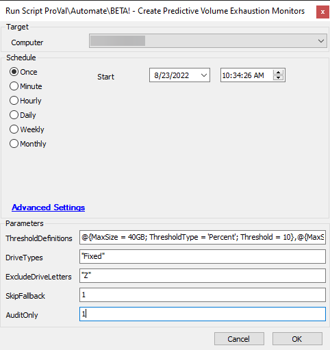

## Summary

This script is used to generate volume space monitors on the target machine for each type of drive specified.

## Sample Run

## Dependencies

- [EPM - Disk - Agnostic - Get-VolumeExhaustionEstimate](<../../powershell/Get-VolumeExhaustionEstimate.md>)
- [EPM - Disk - Agnostic - Get-VolumeThresholds](<../../powershell/Get-VolumeThresholds.md>)
- PowerShell v5

## Variables

| Name              | Description                                                                                      |
|-------------------|--------------------------------------------------------------------------------------------------|
| ExistingMonitors  | Used to store a comma-separated list of existing monitors generated by this script.             |

### Global Parameters

| Name               | Example | Required | Description                                                                                                                                                                                                 |
|-------------------|---------|----------|-------------------------------------------------------------------------------------------------------------------------------------------------------------------------------------------------------------|
| MinimumSize       | 1MB     | True     | The minimum size of volume to monitor for. Default is 1MB. Can be an integer or in [Integer literal](https://docs.microsoft.com/en-us/powershell/module/microsoft.powershell.core/about/about_numeric_literals?view=powershell-7.2#integer-literals) notation. |
| DynamicThresholds  | 1       | True     | Set this global to 1 to enable linear regression modeling for volume space.                                                                                                                              |
| MinimumSamples    | 30      | True     | The minimum number of samples that a volume must have before dynamic thresholds will be calculated. See Implementation Guide for more information.                                                       |
| DaysToReport      | 14      | True     | The maximum number of days of samples that the script will use when calculating the linear regression for dynamic thresholds. See Implementation Guide for more information.                             |
| DaysToLead        | 14      | True     | The number of days before volume space exhaustion that the script will use to calculate the threshold. See Implementation Guide for more information.                                                     |
| AlertTemplate      | 3       | True     | The ID of the alert template to use for ticketing.                                                                                                                                                       |
| Interval          | 300     | True     | The interval in seconds that the generated monitor will run in.                                                                                                                                         |
| ReportCategory    | 12      | True     | The ID of the report category to use for the monitor.                                                                                                                                                    |
| TicketCategory    | 6       | True     | The ID of the ticket category to use for the monitor.                                                                                                                                                    |

### User Parameters

| Name                  | Example                     | Required | Description                                                                                                                                                                                                                                                                                                                                 |
|-----------------------|-----------------------------|----------|---------------------------------------------------------------------------------------------------------------------------------------------------------------------------------------------------------------------------------------------------------------------------------------------------------------------------------------------|
| ThresholdDefinitions   | See Implementation Guide    | False    | A list of hashtables representing the thresholds to check for. The hashtables must have the following properties: - MaxSize: The maximum volume size that the specified threshold applies to. - ThresholdType: The type of threshold to use. Must be either 'Percent' or 'Number'. - Threshold: The threshold to calculate for the volume. If ThresholdType is 'Percent', this must be under 100. See Implementation Guide for more information. |
| DriveTypes            | "Fixed","Removable"         | False    | A list of the types of drives to review space for. Valid options are: - 'Unknown' - 'Invalid Root Path' - 'Removable' - 'Fixed' - 'Remote' - 'CD-ROM' - 'RAM Disk' See Implementation Guide for more information.                                                                                       |
| ExcludeDriveLetters    | "C","Z"                     | False    | A list of drive letters to exclude from the review.                                                                                                                                                                                                                                                                                       |
| SkipFallback          | 1                           | False    | Prevent fallback to static thresholds. This is used primarily when a separate static threshold disk monitoring solution is being used.                                                                                                                                                                                                 |
| AuditOnly             | 1                           | False    | Do not create volume space monitors and only record data. Implies "SkipFallback" and will ignore the "SkipFallback" parameter passed. The script will still create the "Volume Space Sampling" monitor. Existing predictive monitors will be removed.                                                                                   |

## Process

The script writes and passes the required variables to the Execute Script step. The following processes occur in the Execute Script step:

1. Variables are validated and written to a hashtable.
2. The script [Get-VolumeThresholds](<../../powershell/Get-VolumeThresholds.md>) is downloaded.
   - If the script fails to download and an existing copy does not exist, then a failure is logged.
3. The script [Get-VolumeThresholds](<../../powershell/Get-VolumeThresholds.md>) is executed with the parameter hashtable [splatted](https://docs.microsoft.com/en-us/powershell/module/microsoft.powershell.core/about/about_splatting?view=powershell-7.2) in.
4. The return object is looped through to create INSERT or UPDATE statements based on the ExistingMonitors variable.
   - If the script would produce an INSERT statement for a monitor that has the same name as an existing monitor, then an UPDATE statement is produced instead.
5. The set of SQL queries is returned back out to the Automate script.
6. The returned SQL queries are executed to either create or update volume space monitors.
7. The monitor "Volume Space Sampling" is generated.

## Output

- Script log
- Local file on computer

