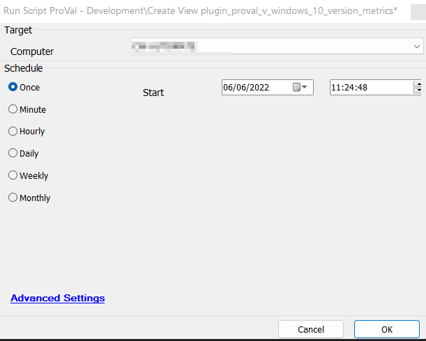

## Summary

The script will create the view [plugin_proval_v_windows_10_version_metrics](https://proval.itglue.com/5078775/docs/9373661), which is used by the dataview, "[Windows - Windows 10 Version Metrics + Filters + Client Filters (reference table)](https://proval.itglue.com/5078775/docs/9373201)."

## Sample Run

## Dependencies

- [Windows - Windows 10 Version Metrics + Filters + Client Filters (reference table)](https://proval.itglue.com/5078775/docs/9373201)
- [plugin_proval_v_windows_10_version_metrics](https://proval.itglue.com/5078775/docs/9373661)
- [CWM - Automate - Script - Update User Permissions for ProVal Custom Tables](<./MySQL - Permission - Set Custom Table Permissions.md>)

## Process

This section executes the SQL query to create the `plugin_proval_v_windows_10_version_metrics` view.

