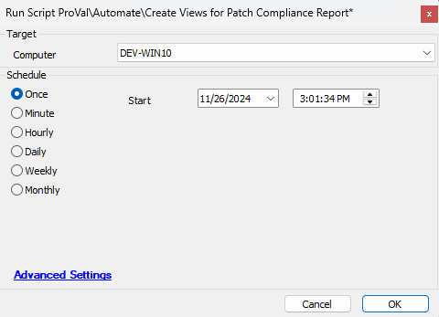

## Summary

This document creates all the necessary items in the database to ensure the [Patch Compliance Reporting Solution](https://proval.itglue.com/5078775/docs/17889366) functions correctly. This script will create the following items:

1. View: `plugin_proval_clientpatchstatsserver`
2. View: `plugin_proval_clientpatchstatsworkstation`
3. View: `plugin_proval_computerpatchcompliance`

## Sample Run

## Dependencies

There are two prerequisites that need to be installed for this script to function correctly:

1. The Report Center Plugin must be installed and configured.

Other items depend on this script being run to function, which are listed below:

1. Report - Patch Compliance - CU Audit - All Machines
2. Report - Patch Compliance - CU Audit - Servers
3. Report - Patch Compliance - CU Audit - Workstations

## Output

This is a one-time use script, used to install/create three views. After running it once, this script can be removed from the environment.

