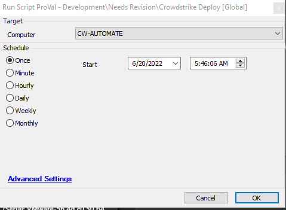

## Summary

This script will install Crowdstrike on an agent.

## Requirements

1. The client-level 'Crowdstrike CID' EDF must be filled in.

## Sample Run

## Variables

| Name | Description |
|------|-------------|
| CID  | Stores the Crowdstrike CID key from the EDF "CrowdStrike CID" |

#### Global Parameters

| Name          | Example   | Required | Description                      |
|---------------|-----------|----------|----------------------------------|
| TicketCreation| 0 or 1   | False    | 1 - Create ticket, 0 - No Ticket |
| URL_Download  | https:// | True     | WindowsSensor.exe package        |

## Process

This script will install Crowdstrike on an agent using the CID key provided in the Client EDF "Crowdstrike CID" and the installer package. It checks for Crowdstrike; if it's not present, it then checks whether the key and URL are provided. If any part is missing, the script will exit. If all parts are confirmed, it will attempt to install Crowdstrike and verify its progress.

## Output

- Script log

