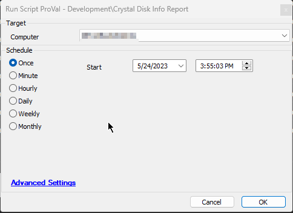
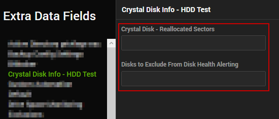
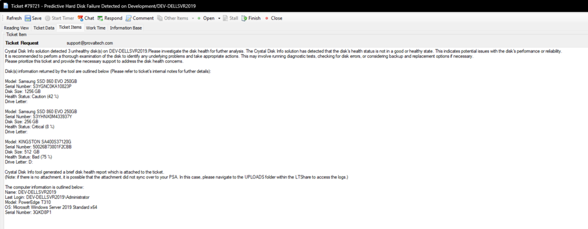
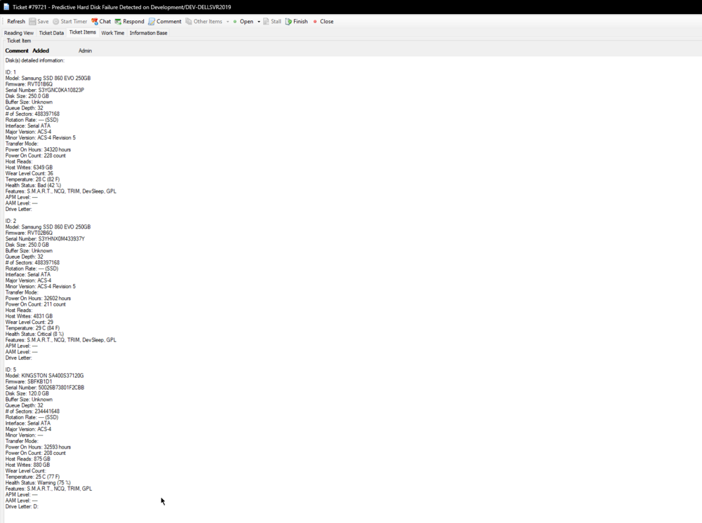
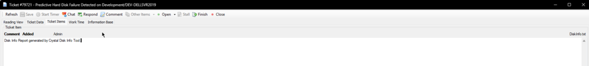
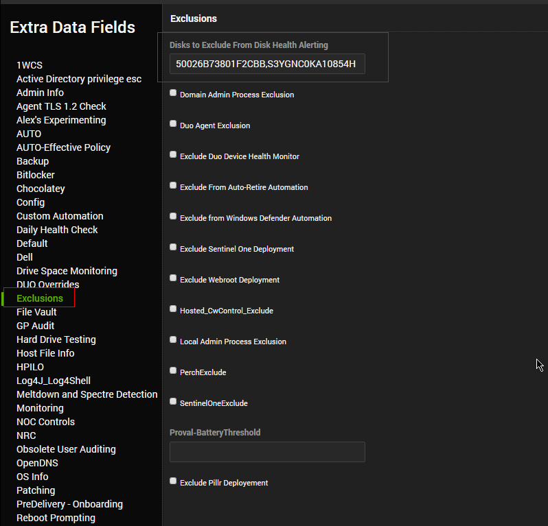

## Summary

The script runs the [Crystal Disk Info tool](https://crystalmark.info/en/software/crystaldiskinfo/) on physical machines, stores the basic disk information returned by the tool in a [custom table](<../tables/pvl_crystal_disk_info.md>), and creates a ticket if the [Health Status](https://crystalmark.info/en/software/crystaldiskinfo/crystaldiskinfo-health-status/) returned by the tool does not contain `Good`. Additionally, it attempts to attach the `DiskInfo.txt` report generated by the tool to the ticket.

It is an Automate implementation of the agnostic script [EPM - Disk - Agnostic - Get-CrystalDiskInfo](<../../powershell/Get-CrystalDiskInfo.md>).

**Note:** The script will not work for virtual machines as the tool only supports physical hard disks.

## Sample Run



The primary usage of the script is to be executed by the [EPM - Disk - Internal Monitor - Execute Script - Crystal Disk Info Report](<../monitors/Execute Script - Crystal Disk Info Report.md>) monitor set.

## Dependencies

- [EPM - Disk - Agnostic - Get-CrystalDiskInfo](<../../powershell/Get-CrystalDiskInfo.md>)
- [CWM - Automate - Script - OverFlowedVariable - SQL Insert - Execute](<./OverFlowedVariable - SQL Insert - Execute.md>)
- [Crystal Disk Info - Ticket Troubleshooting Guide](<../roles/Crystal Disk Info - Ticket Troubleshooting Guide.md>)

## Variables

| Name                   | Description                                                                                               |
|------------------------|-----------------------------------------------------------------------------------------------------------|
| ProjectName            | Get-CrystalDiskInfo                                                                                      |
| TableName              | [pvl_crystal_disk_info](<../tables/pvl_crystal_disk_info.md>)                                          |
| WorkingDirectory        | C:/ProgramData/_automation/script/Get-CrystalDiskInfo                                                   |
| PS1ErrorLog            | C:/ProgramData/_automation/script/Get-CrystalDiskInfo/Get-CrystalDiskInfo-error.txt                    |
| SQLDeleteStatement      | Stores SQL query to remove stale data from the database                                                   |
| SQLStartStatement       | Stores the SQL query to be used to insert fresh data into the database                                    |
| DataPointNames          | Data Points to be passed to [CWM - Automate - Script - OverFlowedVariable - SQL Insert - Execute](<./OverFlowedVariable - SQL Insert - Execute.md>) script |
| JsonFileName           | Get-CrystalDiskInfo.Json                                                                                 |
| psout                  | Output of the PowerShell script running the [Crystal Disk Info tool](https://crystalmark.info/en/software/crystaldiskinfo/) |
| FileUploadComment      | Comment to add to the ticket regarding the status of the `DiskInfo.txt` file                             |
| AttachFile             | 1 if the `DiskInfo.txt` file is found on the machine, used to determine whether to attach the file to the ticket or not |
| FileUploadFailureComment| Comment to add to the ticket if the script fails to find/generate the `DiskInfo.txt` file                |
| TicketCreationCategory  | ID of the ticket category for the ticket to be generated                                                  |
| TicketVariable          | Contains four variables: ExistingTicketId, TicketSubject, TicketBody, InternalNotes                     |
| ExistingTicketID       | Ticket ID of an already open ticket for the computer.                                                    |
| TicketSubject           | Subject of the ticket to create                                                                            |
| TicketComment           | Ticket Summary for the new ticket/Comment to add to the already existing ticket                          |
| InternalNotes          | Detailed information of the disk showing failures, to be added as an internal note/comment to the ticket  |
| ErrorLog               | Content of the Error Log file generated by the agnostic script, if any                                   |

## Global Parameters

| Name                          | Default | Required | Description                                                                                                                                                                                                                                                                                                                                                                                                                                     |
|-------------------------------|---------|----------|-------------------------------------------------------------------------------------------------------------------------------------------------------------------------------------------------------------------------------------------------------------------------------------------------------------------------------------------------------------------------------------------------------------------------------------------------|
| ServerTicketCreationCategory   | 0       | False    | Setting a predefined ticket creation category will set a specified ticket creation category for server-type devices. Setting the ticket category in the script will override the ticket category set either at group or computer levels. The ticket category settings are defined properly in the [monitor set's](<../monitors/Execute Script - Crystal Disk Info Report.md>) document. 0 in the value represents that this global property is not in use. |
| WorkstationTicketCreationCategory| 0     | False    | Setting a predefined ticket creation category will set a specified ticket creation category for workstation-type devices. Setting the ticket category in the script will override the ticket category set either at group or computer levels. The ticket category settings are defined properly in the [monitor set's](<../monitors/Execute Script - Crystal Disk Info Report.md>) document. 0 in the value represents that this global property is not in use. |
| ReallocatedSector              | 50      | True     | Set the threshold for the number of reallocated sectors to mark an HDD as `caution` (not applicable to SSDs).                                                                                                                                                                                                                                                                                                                                 |

## Extra Data Fields

| Name                                             | Level    | Type  | Example                                         | Description                                                                                                                                                                                                                     |
|--------------------------------------------------|----------|-------|-------------------------------------------------|---------------------------------------------------------------------------------------------------------------------------------------------------------------------------------------------------------------------------------|
| Disks to Exclude From Disk Health Alerting       | Computer | Text  | 50026B73801F2CBB,50026B73801F2CBC               | Comma-separated list of the Serial Numbers of the Disk(s) to exclude from alerting.                                                                                                                                           |
| Crystal Disk - Reallocated Sectors               | Computer | Text  | 70                                              | Threshold for the number of reallocated sectors to mark an HDD as `caution` (not applicable to SSDs). This EDF can be used to overwrite the value stored in the Global Variable `ReallocatedSector`. The default threshold is 50. |



## System Properties

| Name                             | Default | Required | Description                                                                                 |
|----------------------------------|---------|----------|---------------------------------------------------------------------------------------------|
| Crystal_Disk_Info_Disable_Tickets| 0       | False    | 0 or 1 to toggle the ticket creation function of the script.                              |
| Crystal_Disk_Info_Disable_Caution_Tickets| 0 | False | 0 or 1 to toggle ticket creation for disks with the `Caution` Health Status.              |

**Running the script against any online physical Windows computer will create the system properties.**

## Output

- Script Log
- Data view
- Ticket

## Ticketing

**Subject:** `Predictive Hard Disk Failure Detected on \\<ClientName>/\\<ComputerName>`

**Ticket Body:**

```
Crystal Disk Info solution detected \\<Number of Unhealthy Disks> unhealthy disk(s) on \\<ComputerName>. Please investigate the disk health for further analysis. The Crystal Disk Info solution has detected that the disk's health status is not in a good or healthy state. This indicates potential issues with the disk's performance or reliability.
It is recommended to perform a thorough examination of the disk to identify any underlying problems and take appropriate actions. This may involve running diagnostic tests, checking for disk errors, or considering backup and replacement options if necessary.
Please prioritize this ticket and provide the necessary support to address the disk health concerns.
```

```
Disk(s) information returned by the tool are outlined below (Please refer to the ticket's internal notes for further details):
Model: \\<Disk 1 Model>
Serial Number: \\<Disk 1 Serial Number>
Disk Size: \\<Disk 1 Size>
Health Status: \\<Disk 1 Health Status>
Drive Letter: \\<Disk 1 Drive Letter(s)>

Model: \\<Disk 2 Model>
Serial Number: \\<Disk 2 Serial Number>
Disk Size: \\<Disk 2 Size>
Health Status: \\<Disk 2 Health Status>
Drive Letter: \\<Disk 2 Drive Letter(s)>

Model: \\<Disk n Model>
Serial Number: \\<Disk n Serial Number>
Disk Size: \\<Disk 3 Size>
Health Status: \\<Disk n Health Status>
Drive Letter: \\<Disk n Drive Letter(s)>

\\<File Upload Comment>
```

The computer information is outlined below:
```
Name: \\<Computer Name>
Last Login: \\<Logged In User>
Model: \\<Computer Model>
OS: \\<Operating System>
Serial Number: \\<Serial Number>
```

Refer to the troubleshooting guide at [https://proval.itglue.com/5078775/docs/14394330](https://proval.itglue.com/5078775/docs/14394330).  
If you're logged into an ITGlue portal, open the URL in a Private Window.

**\<File Upload Comment>** can vary depending on the existence of the disk health report **`DiskInfo.txt`**

If the script fails to find the file:  
```
PowerShell Script failed to generate the Crystal Disk Info report.  
The result returned by the script can be checked from the internal notes in the ticket.
```

Comment to add to the internal notes if the script fails to find the file:  
```
PowerShell Script failed to generate the Crystal Disk Info report.  
The result returned by the script is:  
\\<PsOut>
```

If the script finds and uploads the file:  
```
Crystal Disk Info tool generated a brief disk health report which is attached to the ticket.  
(Note: if there is no attachment, it is possible that the attachment did not sync over to your PSA. In this case, please navigate to the UPLOADS folder within the LTShare to access the logs.)
```

The following information for each drive not showing **Good** status will be added to the ticket's internal note/comment:  
```
ID: \\<DiskID>
Model: \\<Disk Model>
Firmware: \\<Disk Firmware>
Serial Number: \\<Disk Serial Number>
Disk Size: \\<Disk Size>
Buffer Size: \\<Buffer Size>
Queue Depth: \\<Queue Depth>
# of Sectors: \\<Number of Sectors>
Rotation Rate: \\<Rotation Rate>
Interface: \\<Interface>
Major Version: \\<Major version>
Minor Version: \\<Minor Version>
Transfer Mode: \\<Transfer Mode>
Power On Hours: \\<Power On Hours>
Power On Count: \\<Power On Count>
Host Reads: \\<Host Reads>
Host Writes: \\<Host Writes>
Wear Level Count: \\<Wear Level Count>
Temperature: \\<Disk Temperature>
Health Status: \\<Health Status>
Features: \\<Disk Features>
APM Level: \\<Disk APM Level>
AAM Level: \\<Disk AAM Level>
Drive Letter: \\<Drive Letter(s)>
```

Additional internal notes:  
```
To exclude this disk from disk health alerting: Open the computer in Automate, navigate to Extra Data Fields, and under the "Exclusions" tab, find the "Disks to Exclude From Disk Health Alerting" field. Add the serial number for this disk to this field: \{Drive Serial Number}. Click Save. You can add additional disk serial numbers separated by comma for a single computer to exclude multiple drives from disk health alerting.
```

**Sample Ticket:**

**Ticket Summary and Subject:**  


**Internal Notes/Comment:**  


Attached **`DiskInfo.txt`** File:  


## Excluding Disk(s) from Alerting

- Gather the serial number(s) of the disk(s) to exclude from the generated ticket.  
- Add the serial number to the computer-level EDF `Disks to Exclude From Disk Health Alerting`. Multiple serial numbers can be separated by a comma. Do not add a space after the comma.  

e.g.,  



