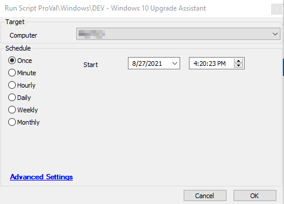

## Summary

This script starts the Windows Upgrade Assistant to upgrade the target system to the latest version of Windows 10.  
Time Saved by Automation: 120 Minutes

## Sample Run

## Dependencies

- @Post Win 10 Upgrade Assistant check (Script)
- The target machine must be a Windows-based machine. This script may upgrade eligible machines running older Windows operating systems, like Windows 7.

## Variables

### Script States

| Name                  | Example   | Description                                           |
|-----------------------|-----------|-------------------------------------------------------|
| Win10PreUpgradeVer    | 2009      | This will display the Windows version before the upgrade. |
| Win10PreUpgradeDate   | 8/27/2021 | This is the date when the script ran.                |

## Process

- Stores the current Windows version and date when the script ran, in a script state variable.
- Executes a PowerShell script that will download, install, and run the Windows 10 Upgrade Assistant. The script will output the results from the start of the application to the `@psout@` variable.
- The script will then sleep for 2 minutes and then check to see if the `Windows10UpgraderApp` process is running. The upgrade process can take several hours depending on the age of the device being updated. (The older the version of Windows, the longer this script may take as it downloads the requirements for the latest build of Windows.)
- If the process for the Windows 10 app exists, the script will exit successfully as the machine has begun the process to upgrade the device. If the process is not running the script will exit with an error indicating that the script failed to start the process and to review the device to ensure it is eligible to be upgraded.
- Once the process is initiated, it schedules another script "@Post Win 10 Upgrade Assistant check" on the agent to run after an interval of 6 hours, to validate if the upgrade assistant was able to update the machine.

## Output

- Script log

