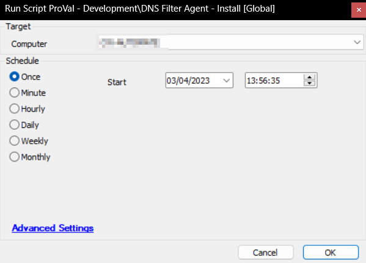

## Summary

This script is customized for a particular client and aims to fulfill the request specified in ticket T20230331.0168, which involves extensive modification of the 'Spade - DNSFilter deployment' script. Its main objective is to enable the installation of DNS Filter Agent by utilizing a pre-populated EDF to acquire the necessary values. To run the script successfully, the client-level EDF DNSFilter Site Key must be present and completed; otherwise, a ticket will be generated, and the script will fail. The script is compatible with both Macintosh machines and Windows workstations, but not with Windows servers since they do not support DNS Filter Agent.

## Sample Run

## Variables

| Name           | Description                                   |
|----------------|-----------------------------------------------|
| SITESECRETKEY  | DNSFilter Site Key                           |
| Tickid         | Ticketid of existing new/open ticket         |
| Body           | Message to add to the Ticket Body            |
| Shellresult    | Output returned by the installation command   |

#### Global Parameters

| Name                    | Example | Required | Description                                                                                   |
|-------------------------|---------|----------|-----------------------------------------------------------------------------------------------|
| TicketCreationCategory   | 256     | False    | Add the id of a relevant ticket category to create a ticket on failure. The default value is 0, and the script will not create tickets. |

## EDF

| Name                   | Level  | Required | Description                                                                                   |
|------------------------|--------|----------|-----------------------------------------------------------------------------------------------|
| DNSFilter Site Key     | Client | True     | Add a proper DNSFilter site key before executing the script to install the application        |

## Output

- Script Log
- Ticket

