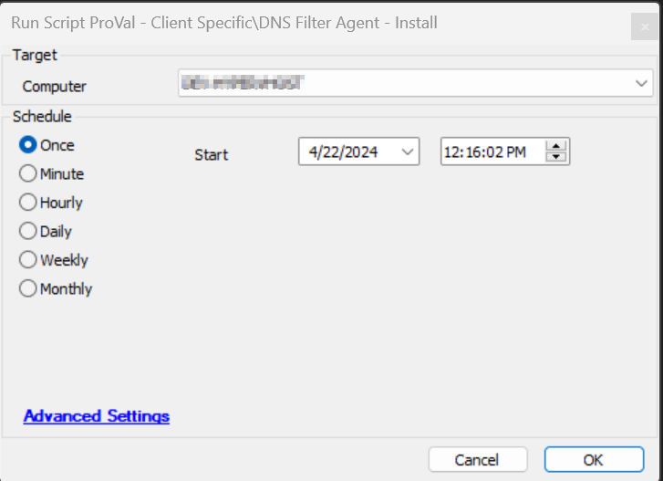

## Summary

This script installs the DNS Filter agent on the machines. It is compatible with both Macintosh machines and Windows workstations, but not with Windows servers since they do not support the DNS Filter Agent.

## Sample Run

## Variables

| Name                  | Description                                                                                              |
|-----------------------|----------------------------------------------------------------------------------------------------------|
| Tickid                | Ticket ID of the existing new/open ticket                                                                |
| Body                  | Message to add to the Ticket Body                                                                         |
| Shellresult           | Output returned by the installation command                                                                |
| CompKey               | Stores the secret key from computer-EDF 'DNSFilter Computer Key'                                         |
| Lockey                | Stores the secret key from location-EDF 'DNSFilter Location Key'                                         |
| Sitekey               | Stores the secret key from client-EDF 'DNSFilter Site Key'                                              |
| CompSecretKey         | Checks if the computer's secret key is present. Note: The computer secret key has the highest priority over the client/location secret key. |
| LocSecretKey          | Checks if the location's secret key is present. Note: The location secret key has the highest priority over the client secret key. |
| ClientSecretKey       | Checks if the client's secret key is present. Note: The client secret key is only used if both the computer and location secret keys are empty. |
| TicketCreationCategory | Stores the ticket category ID from the monitor [CWA - Solution - DNS Filter Agent Deployment](<../../solutions/DNS Filter Agent Deployment.md>) |
| SecretKey             | The final secret key used for the installation                                                             |

## EDFs

| Name                          | Level   | Type    | Description                                                                                           |
|-------------------------------|---------|---------|-------------------------------------------------------------------------------------------------------|
| Deploy DNS Filter Agent       | Client  | Flag    | If set to 1, the DNS filter agent will be installed on the agents of the client.                     |
| Exclusion of DNS Filter Agent  | Location| Flag    | If set to 1, the DNS filter agent will be excluded from the agents of the location.                  |
| Exclusion of DNS Filter Agent  | Computer| Flag    | If set to 1, the DNS filter agent will not be installed on the computer.                             |
| DNSFilter Computer Key        | Computer| Text    | Stores the secret key at the computer level. It overrides the secret key present at the location/client level. |
| DNSFilter Location Key        | Location| Text    | Stores the secret key at the location level. It overrides the secret key present at the client level. |
| DNSFilter Site Key            | Client  | Text    | Stores the secret key at the client level. This key only works when both the location (DNSFilter Location Key) and computer level EDF (DNSFilter Computer Key) are empty. |

## Output

- Script Log
- Ticket

