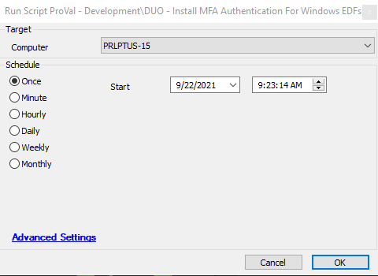
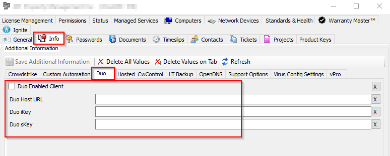
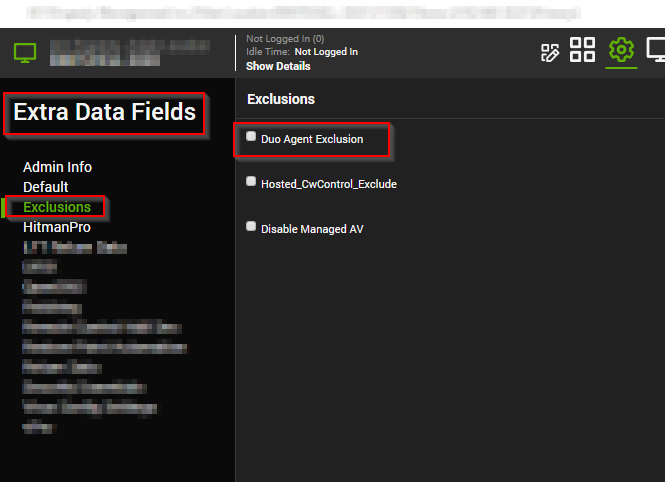

## Summary

This document uses Client and Agent Level EDFs and an internal monitor to ensure that DUO software is installed for all agents within a client.

## Sample Run

## Dependencies

- **Client EDF**  
  

- **Agent EDF for exclusion** (Will prevent the monitor from picking up the agent / forcing DUO install)  
  

## Variables

Document the various variables in the script. Delete any section that is not relevant to your script.

#### Global Parameters

| Name                     | Example | Required | Description                                                      |
|--------------------------|---------|----------|------------------------------------------------------------------|
| AUTOPUSH                 | #0      | True     | DUO Install Parameter - review DUO documentation                 |
| FAILOPEN                 | #1      | True     | DUO Install Parameter - review DUO documentation                 |
| RDPONLY                  | #0      | True     | DUO Install Parameter - review DUO documentation                 |
| Ticketing                | 1       | True     | 1 = Ticket on Failure                                            |
| TicketCreationCategory    | 123     | False    | If set, will override default ticket category if Ticketing = 1   |

## Process

Sets all variables from EDFs and Script Globals. The process will exit if required variables are not set. It downloads the DUO MSI File from [https://dl.duosecurity.com](https://dl.duosecurity.com), installs according to DUO documentation, and confirms that the software is installed. A ticket will be created on failure if the global variable is set.

## Output

- Script Log
- Ticket - Optional

