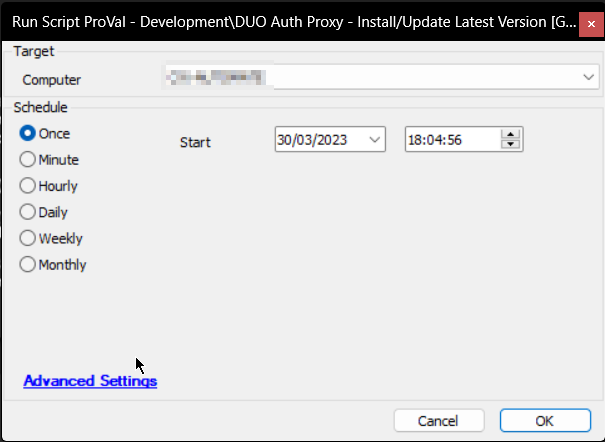

## Summary

The script installs or updates the DUO Authentication Proxy application to the latest available version. It can run either manually or as an Autofix from the [CWM - Automate - Remote Monitor - ProVal - Development - Software - Update - DUO Auth Proxy](<../monitors/DUO Auth Proxy.md>) monitor set.

## Sample Run



## Dependencies

- [CWM - Automate - Remote Monitor - ProVal - Development - Software - Update - DUO Auth Proxy](<../monitors/DUO Auth Proxy.md>)

## Variables

| Name               | Description                                                             |
|--------------------|-------------------------------------------------------------------------|
| STATUS             | Status returned by the internal monitor (SUCCESS/FAILED)                |
| ProjectName        | Duo_Auth_Proxy                                                          |
| WorkingDirectory    | C:/ProgramData/_automation/app/Duo_Auth_Proxy                          |
| EXEPath            | C:/ProgramData/_automation/app/Duo_Auth_Proxy/Duo_Auth_Proxy.exe      |
| LatestVersion      | Latest version of the application                                        |
| Subject            | Ticket subject                                                          |
| Body               | Ticket body                                                             |
| Tickid             | Ticket ID to comment on, if an open/new ticket already exists           |
| PowerShellResult   | Result of the PowerShell command attempting to download and install/update the application |

#### Global Parameters

| Name                  | Example | Required | Description                                                                 |
|-----------------------|---------|----------|-----------------------------------------------------------------------------|
| Ticketcreationcategory | 123     | False    | Set it to a valid ticket category ID to enable ticketing on failure. Default is 0 |

## Output

- Script logs
- Ticket (if enabled)

## Ticketing

**Subject:**

```
DUO Security Authentication Proxy Update Failed on %ComputerName% at %ClientName%
```

**Body:**

```
%ComputerName%
The script to update DUO Security Authentication Proxy has failed - please review/update manually.
Script Logs -
%PowerShellResult%
```

