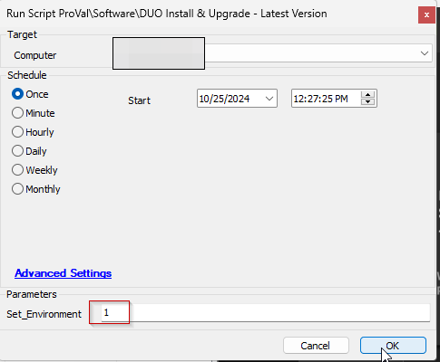
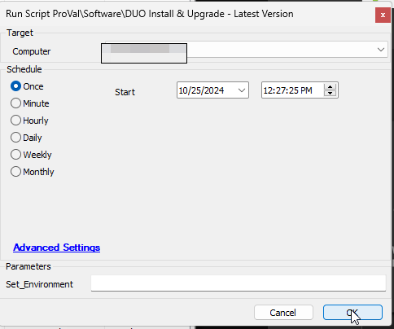
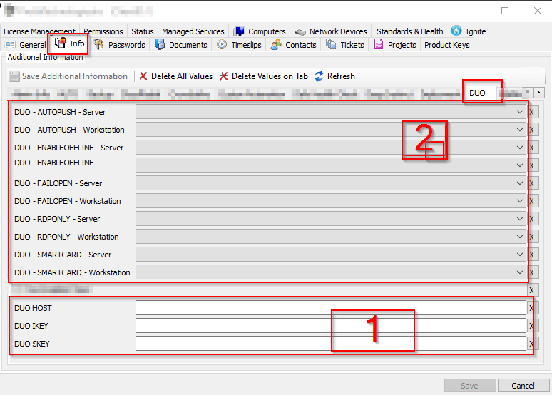
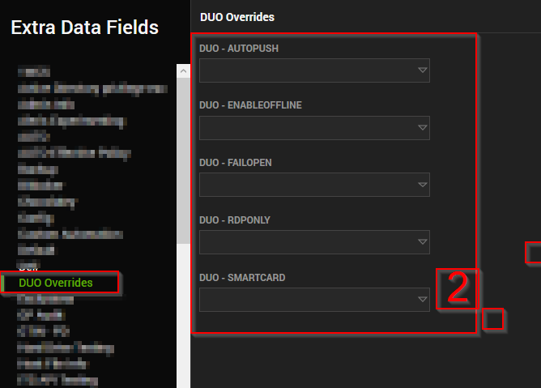
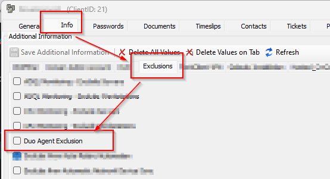
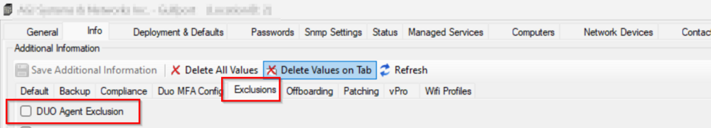

## Summary

This script will install or update DUO if the currently installed instance is older than the latest released version.  
This script does match the hash of the installer from the official website before deploying it.  
This script downloads the latest installer from [https://dl.duosecurity.com/duo-win-login-latest.exe](https://dl.duosecurity.com/duo-win-login-latest.exe).  

## Sample Run

**First Run:** Run the script against any online windows machine with the `Set_Environment` parameter set to `1` to create the EDFs used by the solution.  
  

**Regular Execution:**  


## Requirements

1. **Specific EDF values must be set for this to work properly**  
   EDFs used are:  

   Client-Level:  
     

   - EDFs in box 1 are being used with the ExtraDataGet function, hence, will be imported with the script.
   - EDFs in section 2 will not be imported with the script and are necessary to define the value of the @Arguments@ variable.
   - To import all the EDFs present in section 2, Run the script against any online windows machine with the `Set_Environment` parameter set to `1`.

2. **Overrides should be set at the computer level, as shown below:**  
     

3. **Exclusions EDFs:**  
   Client Exclusion EDF:  
     

   Location Exclusion EDF:  
     

   Computer Exclusion EDF:  
     

   Exclusions EDFs are being used with the ExtraDataGet function, hence, will be imported with the script.

## EDFs

| Name        | Required | Description                                                                                                                                                                                                                                                  |
|-------------|----------|--------------------------------------------------------------------------------------------------------------------------------------------------------------------------------------------------------------------------------------------------------------|
| AUTOPUSH    | False    | If set to "Yes", this option will automatically send a push request to the user’s device when they attempt to log in. The default value is blank, which requires the user to manually request the push.                                                  |
| FAILOPEN    | False    | This determines the behavior when Duo’s service cannot be reached. If set to "Yes", the system will allow the user to log in (fail open). If set to No or left blank, the system will deny access (fail closed). The default is to fail to open.               |
| RDPONLY     | False    | When set to "Yes", Duo authentication is required only for remote logins via RDP. If set to No or left blank, Duo authentication is required for both console and RDP logins. The default is blank, meaning Duo protects both.                             |
| SMARTCARD   | False    | If set to "Yes", it allows smart card login as an alternative to Duo authentication. If set to No or left blank, it disables the Windows smart card provider. The default is blank, which does not allow smart card login without Duo approval.              |
| ENABLEOFFLINE| False   | If set to "Yes", it will control whether offline access is permitted. In the context of Duo, offline access allows users to authenticate without a real-time connection to Duo’s service, usually by using previously generated passcodes or other offline methods. |
| IKEY        | True     | This is a unique identifier for your integration with Duo’s service. It’s used to link the authentication requests from your application to the correct Duo account. You can find the IKEY in your Duo Admin Panel under the application’s properties page.   |
| SKEY        | True     | This is a sensitive piece of information, akin to a password, used in conjunction with the IKEY. The SKEY is used to sign communication between your application and Duo’s service securely. It’s crucial to keep this key confidential to prevent unauthorized access. |
| HKEY        | True     | The Host Key or API Hostname, which is the endpoint in Duo’s service that your application communicates with. This hostname is also found in the Duo Admin Panel and is necessary for setting up the integration.                                            |

Note: These arguments are passed during the installation process to set up the desired configuration for how Duo Authentication will operate on the Windows system. It’s important to note that the parameter names are case-sensitive.  
Here’s an example of how you might use these arguments in a command to install Duo Authentication for Windows Logon:  
```bash
duo-win-login-latest.exe /S /V"/qn IKEY=/"Your_IKEY/" SKEY=/"Your_SKEY/" HOST=/"Your_HOST/" AUTOPUSH=/"#1/" FAILOPEN=/"#1/" SMARTCARD=/"#1/" RDPONLY=/"#0/""
```

## Variables

| Name         | Description                                                                                                      |
|--------------|------------------------------------------------------------------------------------------------------------------|
| Host         | To store the value of the Client level EDF, DUO HOST                                                           |
| SKEY         | To store the value of the Client level EDF, DUO SKEY                                                           |
| IKEY         | To store the value of the Client level EDF, DUO IKEY                                                           |
| Arguments    | Arguments to be passed to the command, calculated by a SQL query on the basis of the client and computer level "DUO - *" EDFs. |
| DuoFileName  | Name of the file present at [https://dl.duosecurity.com/duo-win-login-latest.exe](https://dl.duosecurity.com/duo-win-login-latest.exe) |
| FileMajorVersion | @DuoFIleName@ will come along with a numeric version and that version is extracted and stored to the FileMajorVersion |
| RawHash      | Hash Value for the @DuoFIleName@ at [https://duo.com/docs/checksums#duo-windows-logon](https://duo.com/docs/checksums#duo-windows-logon) |
| FileHash     | Hash value for the file downloaded from [https://dl.duosecurity.com/duo-win-login-latest.exe](https://dl.duosecurity.com/duo-win-login-latest.exe) |
| ApplicationVersion | Version of the file downloaded from [https://dl.duosecurity.com/duo-win-login-latest.exe](https://dl.duosecurity.com/duo-win-login-latest.exe) |
| InstallComparision | @ApplicationVersion@ is compared with the version of currently installed instance to find whether DUO is NoTInstalled, OutOfDate, or UpToDate. |
| %shellresult% | Outcome of the installation command executed                                                                     |

## Global Variables

| Name        | Example                                                       | Required | Description                                         |
|-------------|---------------------------------------------------------------|----------|-----------------------------------------------------|
| OutFile     | C%3A%5CWindows%5CLTSvc%5CPackages%5CDuoInstaller.exe         | True     | FullPath to Download DUOInstaller.exe               |
| OutFolder   | C%3A%5CWindows%5CLTSvc%5CPackages                             | True     | Folder to store the DUOInstaller.exe                 |

## User Parameters

| Name             | Example | Required                    | Description                                                                                                                                                                                                 |
|------------------|---------|-----------------------------|-------------------------------------------------------------------------------------------------------------------------------------------------------------------------------------------------------------|
| Set_Environment   | 1       | True (for first execution)  | Run the script with the `Set_Environment` parameter set to **1** to create the EDFs used by the solution.                                                                                                 |

## Output

- Script log


