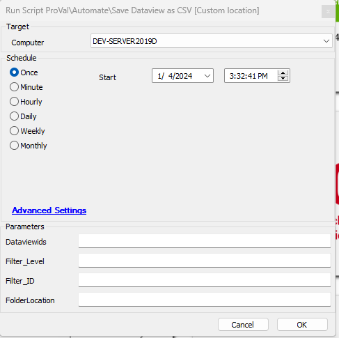

## Summary

This script is a copy of [CWM - Automate - Script - Dataview - Email as CSV [Param]](./Dataview - Email as CSV Param.md) script. Instead of overwriting the existing Dataview CSV file, it saves a distinct copy each time it runs in a custom folder location defined by the user. Additionally, it does not send an email to anyone.

## Sample Run

#### Additional User Parameter

| Parameter        | Example                               | Required | Description                                                                                   |
|------------------|---------------------------------------|----------|-----------------------------------------------------------------------------------------------|
| Folder Location   | C:/ProgramData/_automation/script     | True     | Provide the folder location where you would like to preserve the Dataview file on the machine |

All other parameters are the same as those in [CWM - Automate - Script - Dataview - Email as CSV [Param]](./Dataview - Email as CSV Param.md).

