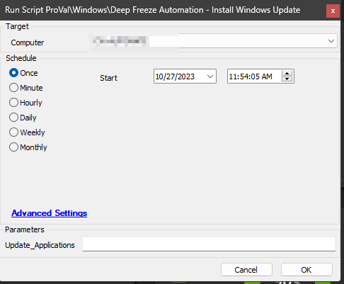
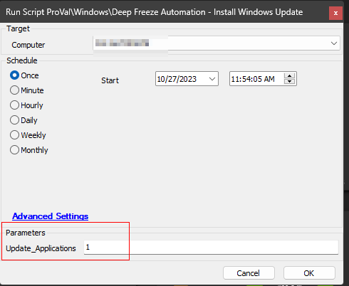

## Summary

The script aims to facilitate the installation of Windows updates on computers using the [Deep Freeze Tool](https://www.faronics.com/assets/DFS_Manual.pdf). It follows the process outlined below:

- **Ensure THAWED State:** The script will verify if the computer is in the THAWED state (a state that allows changes to be made). If not, it will restart the computer in THAWED mode.
- **Push Windows Updates:** Once the computer is in the THAWED state, the script will initiate the command to push available Windows updates to the system.
- **Allow Installation Time:** The script will grant an hour for the Windows updates to install on the computer.
- **Restore FROZEN State:** After the installation time elapses, the script will restart the computer, this time reverting it back to the FROZEN mode (a state that restricts changes and preserves the system in its original state).

**Note:** It is essential to run the script a few hours before regular working hours to minimize any potential impact on user experience. The script may involve multiple computer restarts and could take up to 2 hours to complete the entire update process. It is crucial to exercise caution and perform appropriate testing before implementing the script to ensure smooth update deployment. By adhering to the recommended schedule and taking necessary precautions, we aim to facilitate seamless Windows updates without disrupting users during their regular working hours.

## Sample Run

To install windows updates only:

To attempt to update the installed applications after installing the Windows updates:

## Requirements

Deep Freeze Commands require a password with Command line rights. OTPs cannot be used.  
Reference: [Faronics Documentation](https://www.faronics.com/webhelp/DFE/840/EN/wwhelp/wwhimpl/common/html/wwhelp.htm#href=Chapter.1.153.html&single=true)

Before executing the script, save the password with the **`Deep Freeze Command Line Password`** title at the client-level Passwords tab. Since this password will be used by the script to execute Deep Freeze Commands on the machines.

## User Parameters

| Name                   | Example | Required | Description                                                                                                                                                                                                                   |
|------------------------|---------|----------|-------------------------------------------------------------------------------------------------------------------------------------------------------------------------------------------------------------------------------|
| Update_Applications     | 1       | False    | The [SWM - Software Configuration - Script - Winget - Update All](https://proval.itglue.com/DOC-5078775-12027191) script will be called before restarting the computer in the Frozen state after installing the Windows updates, if this parameter is set to 1 while running the script. |

### Global Variables

| Name              | Default                             | Required | Description                                                                                                  |
|-------------------|-------------------------------------|----------|--------------------------------------------------------------------------------------------------------------|
| PasswordTitle     | Deep Freeze Command Line Password   | True     | Title of the client-level password entry storing the Deep Freeze Password with Command line rights.          |
| TaskkillAttempt   | 3                                   | True     | Number of times the script will attempt to kill the ongoing tasks before booting the script in windows update mode. |

## Output

- Script Logs

