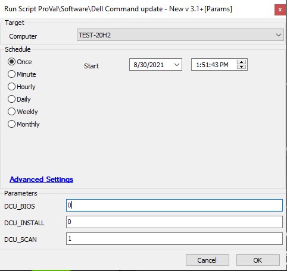

## Summary

This script installs and runs a scan for Dell Command Update.  

**Time Saved by Automation:** 10 Minutes  

## Sample Run

  

## Variables

| Variable | Description |
|----------|-------------|
| Logs     | This contains the Dell command execution failure logs |

#### User Parameters

| Name         | Example | Required | Description                                                                                                   |
|--------------|---------|----------|---------------------------------------------------------------------------------------------------------------|
| DCU_INSTALL  | 1       | False    | Set it to 1 then it will (Just install/Upgrade DCU. No scans or updates)                                     |
| DCU_SCAN     | 1       | False    | Set it to 1 then it will (Install/Upgrade DCU, run a scan, no updates)                                      |
| DCU_BIOS     | 1       | False    | Set it to 1 then it will (Install/Upgrade DCU if needed, run a scan, run updates and attempt BIOS)          |

## Process

This script installs Dell Command Update if not present, updates it to 3.1.2 if needed, configures it, runs a scan, and then runs a one-time Dell firmware update by default if no value is provided in the user parameters.  

## Output

- Script log  

