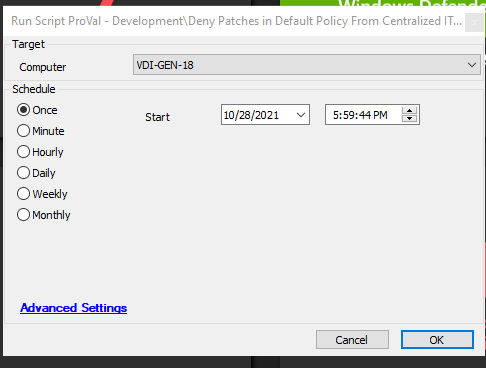
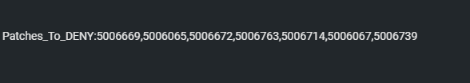

## Summary

The script will gather the KBIDs from the [New Patch Deny Process](<../../unsorted/New Patch Deny Process.md>) and deny the patches listed.

**Time saved by automation:** 20 minutes

## Sample Run

## Dependencies

[Proval IT Glue Documentation](https://proval.itglue.com/5078775/docs/8524500)

## Variables

- `@KBID@`: Stores the output of the PowerShell query fetching the KBIDs from [Proval IT Glue Documentation](https://proval.itglue.com/5078775/docs/8524500).
- `@ApprovalPolicyID@`: Stores the ID of the default approval policy.

## Process

**Step 1:** Add the KBIDs of the patches to be denied after the `Patches_To_DENY:` string under the URL [Proval IT Glue Documentation](https://proval.itglue.com/5078775/docs/8524500). KBIDs should be comma-separated, with no spaces in between or after the IDs. As shown in the attached screenshots:  

**Step 2:** A PowerShell query will fetch those KBIDs to the script and store them under the `@KBID@` variable.

**Step 3:** The default approval policy ID will be saved under the `@ApprovalPolicyID@` variable.

**Step 4:** The script will fetch the hotfix ID for each KBID and deny those hotfix IDs for `@ApprovalPolicyID@`, regardless of the current state.

## Output

The output can be checked from the Approval section of the patch manager.
