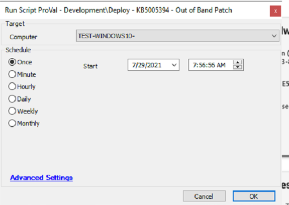

## Summary

The script will install KB5005394 - Out of Band Patch only if it is not installed. Will fulfill and verify the pre-req as well. Script may reboot the computer multiple times. It will reboot after the installation of the patch. A reboot may be performed prior to installation if the computer is in a reboot pending state.

**Time Saved by Automation:** 20 Minutes

## Sample Run

## Variables

- **@PFolder@**: It's a Global Variable storing the path to download the update file.
- **@Reason@**: Stores and logs the download failure, either of pre-requisite or of primary update.
- **@FailureReason@**: Stores and logs the installation failure of primary update.
- **@OSVersion@**: Stores the Operating system version of Windows 10 machines.
- **@RP@**: Used to check if the machine is reboot pending or not.
- **@PrereqCheck@**: Stores the output of powershell script used to verify the installation of required patches in order to install the primary patch.

#### Script States

| Name      | Example   | Description                                                        |
|-----------|-----------|--------------------------------------------------------------------|
| KB5005394 | Installed | Installed, Failed or Download Failed depends on the output of the script. |

## Process

- Exits if KB5005394 is already installed.
- Verifies the OS, if it's windows server 2019 or windows 10 (1809) than script will proceed otherwise exits.
- Will reboot the computer if it's already reboot pending.
- Will download and install the July's SSU after verifying the absence of the required SSU.
- The KB5005394 will be downloaded and installed.
- Check the installation's outcome.
- Modify the script's state according to the outcome.

## Output

- Script log
- Script state

