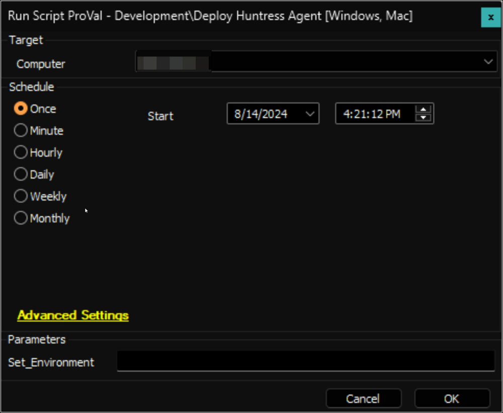
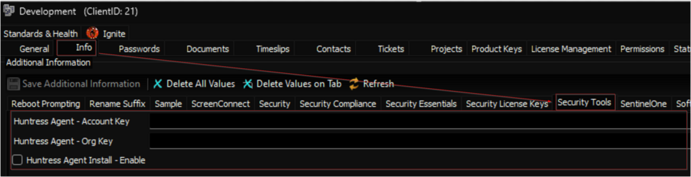
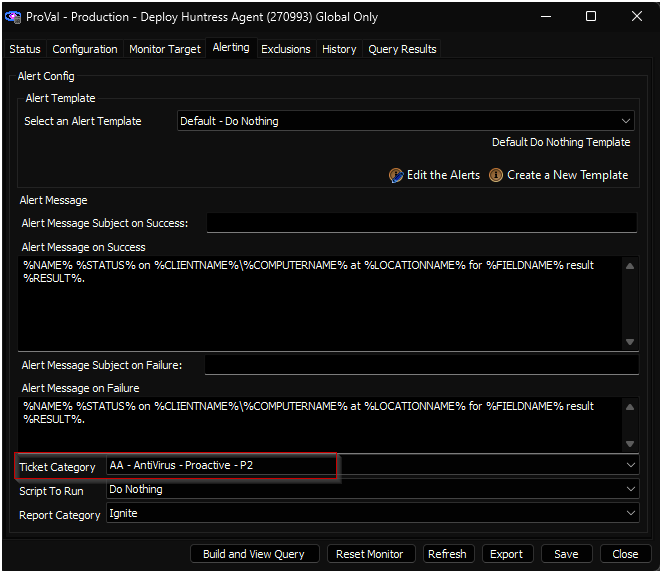

## Summary

The script installs the `Huntress Agent` on both Windows and Macintosh machines. It can create a ticket for failure if it's enabled from the [Deploy Huntress Agent](<../monitors/Deploy Huntress Agent.md>) monitor set.

**File Hash:**

- **MD5:** `8F19848478D623C13615D166134FE8C1`
- **SHA256:** `DFC9C59A249E2C5EA0E3AD26CD9639F7F6953FF9781A17823BF84A6009627076`

## Sample Run

**First Execution:** Run the script against any online Windows computer with the `Set_Environment` parameter set to `1` to create the EDFs used by the solution.


**Regular Execution:**  


## Dependencies

- [raw.githubusercontent.com/huntresslabs/deployment-scripts/main/Powershell/InstallHuntress.powershellv2.ps1](https://raw.githubusercontent.com/huntresslabs/deployment-scripts/main/Powershell/InstallHuntress.powershellv2.ps1)
- [SEC - Windows Protection - Internal Monitor - Deploy Huntress Agent](<../monitors/Deploy Huntress Agent.md>)

## Variables

| Name                    | Description                                               |
|-------------------------|-----------------------------------------------------------|
| projectName             | Invoke-HuntressAgentCommand                               |
| workingDirectory        | C:/ProgramData/_Automation/Script/Invoke-HuntressAgentCommand |
| scriptPath (Windows)    | C:/ProgramData/_Automation/Script/Invoke-HuntressAgentCommand/Invoke-HuntressAgentCommand.ps1 |
| scriptPath (Macintosh) | /tmp/HuntressMacInstall.sh                               |

## User Parameters

| Name              | Example | Required              | Description                                                                                                                                                              |
|-------------------|---------|-----------------------|--------------------------------------------------------------------------------------------------------------------------------------------------------------------------|
| Set_Environment    | 1       | for first execution    | Run the script against any online Windows computer with the `Set_Environment` parameter set to `1` to create the EDFs used by the solution.                          |

## Client-Level EDF

| Name                                 | Type      | Example         | Section        | Required | Description                                                                                                                                                                 |
|--------------------------------------|-----------|------------------|-----------------|----------|-----------------------------------------------------------------------------------------------------------------------------------------------------------------------------|
| Huntress Agent Install - Enable      | Check-Box | 0/1              | Security Tools  | False    | Mark this EDF to enable auto-deployment of the Huntress Agent from the [Deploy Huntress Agent](<../monitors/Deploy Huntress Agent.md>) monitor set.             |
| Huntress Agent - Account Key         | Text      | 1SA2345AASSSS234 | Security Tools  | True     | This is the Account Key that determines which Huntress Account an Agent should be associated with.                                                                         |
| Huntress Agent - Org Key             | Text      | Development       | Security Tools  | False    | By default, the Huntress Organization key is the name of the client. Set this EDF if it's different for the client.                                                             |



## Location-Level EDF

| Name                                 | Type      | Example         | Section        | Required | Description                                                                                                                                                                 |
|--------------------------------------|-----------|------------------|-----------------|----------|-----------------------------------------------------------------------------------------------------------------------------------------------------------------------------|
| Huntress Agent Install - Exclude     | Check-Box | 0/1              | Security Tools  | False    | Mark this EDF to exclude the location from the auto-deployment of the Huntress Agent from the [Deploy Huntress Agent](<../monitors/Deploy Huntress Agent.md>) monitor set. |
| Huntress Agent - Tags                | Text      | Main             | Security Tools  | False    | By default, Huntress Tags is the name of the location. Set this EDF if it's different for the location.                                                                    |

## Computer-Level EDF

| Name                                 | Type      | Example         | Section        | Required | Description                                                                                                                                                                 |
|--------------------------------------|-----------|------------------|-----------------|----------|-----------------------------------------------------------------------------------------------------------------------------------------------------------------------------|
| Huntress Agent Install - Exclude     | Check-Box | 0/1              | Security Tools  | False    | Mark this EDF to exclude the computer from the auto-deployment of the Huntress Agent from the [Deploy Huntress Agent](<../monitors/Deploy Huntress Agent.md>) monitor set. |

## Ticketing

**Subject:** `Huntress Agent Deployment Failure - %ComputerName%`

**Ticket Body for Download Failure:**  
```
Failed to download the installer script from `@downloadUrl@`.
Please ensure that any security application or firewall is not blocking the download URL.
```

**Ticket Body for Missing Account Key:**  
```
Account Key is missing. Please set the Huntress Agent account key in the client-level EDF `Huntress Agent - Account Key` and re-run the script.
```

**Ticket Body for Installation Failure:**  
```
Failed to install Huntress Agent.

Output of the installation command: 
@commandResult@
```

**Ticket Category should be set in the [ProVal - Production - Deploy Huntress Agent](<../monitors/Deploy Huntress Agent.md>) monitor set to enable the ticket creation feature from the script.**  


## Output

- Script log
- Ticket (if enabled)

