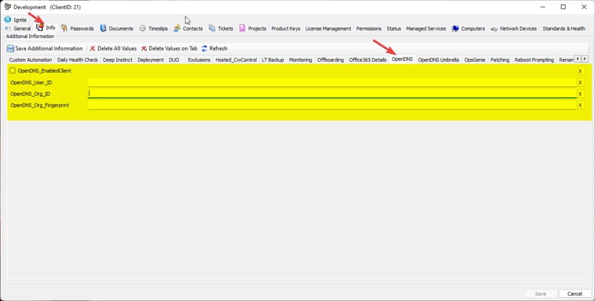
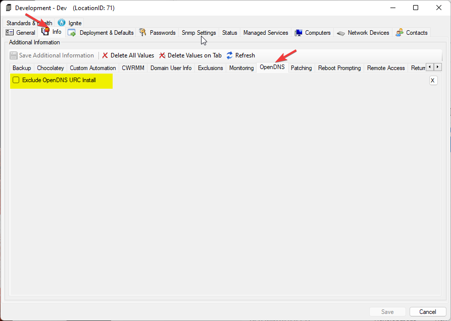
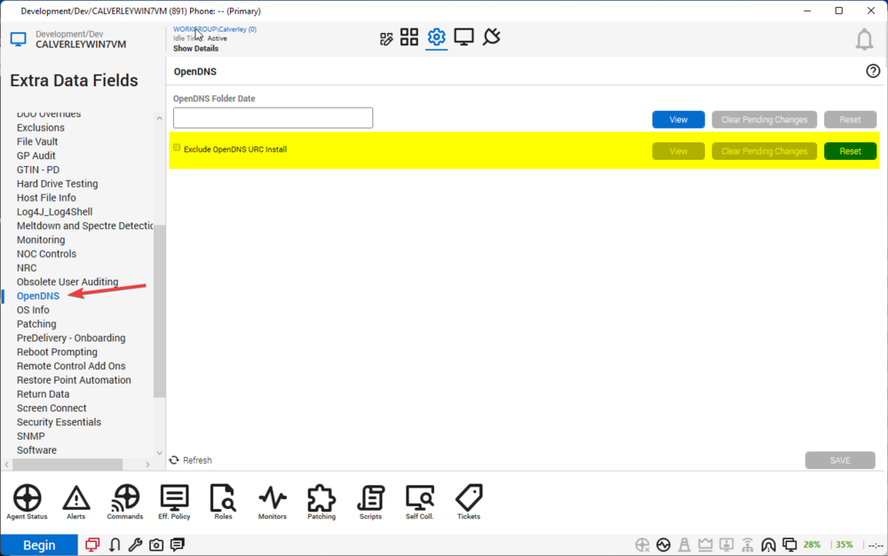
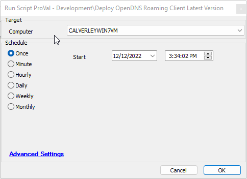

## Summary

This script will query Cisco directly to obtain the newest roaming client installation media and install that software, if necessary, on a target Mac or Windows device.

The script will push an update to the Windows device if an out-of-date version is installed. However, for macOS, it is just a basic installation script.

## Implementation

- Set up the client EDF values as necessary per client.

- Set any location-level exclusions here.

- Set any computer-level exclusions here.

- Import and run the new script.

## Dependencies

- Cisco must continue to support and update their .json [file](https://disthost.umbrella.com/roaming/upgrade/win/production/manifest.json).

## Variables

| Name                     | Description                                                                                         |
|--------------------------|-----------------------------------------------------------------------------------------------------|
| MacVersion               | This variable is specific to macOS devices; it holds the current macOS version for the target machine. |
| VersionRequirementMet     | This variable is specific to macOS devices; it will be true if the current target OS version meets the minimum required version; if it does not, it will be false. |
| IsVirtual                | This variable will be true if the target machine is a virtual machine; if it's not, it will be false. |
| IsARM                    | This variable will be true if the target machine's processor architecture is ARM; if it's not, it will be false. |
| DotNetRequirementSatisfied | This variable will be true if the minimum .NET version of 4.6.2 is met; if it is not, it will be false. |
| opendns_yesno           | This variable is the same variable used by the official solution. It is meant to gather the EDF data to verify if the client should have OpenDNS. |
| OrgID                    | This variable stores the OrgID EDF value for use in the script.                                   |
| userId                   | This variable stores the userID EDF value for use in this script.                                 |
| FingerPrint              | This variable stores the fingerprint EDF value for use in this script.                             |
| CurrentAvailableVersion   | This variable stores the current available OpenDNS version.                                       |
| LatestVersionUrl         | This variable stores the current full URL to the application download.                             |
| URC_YesNo               | This holds the extra data value for excluding OpenDNS URC installation on the current target machine or location. |
| ServiceloopCounter       | Variable used to loop for a set amount of time looking for the service to start.                  |
| FinishStatus             | This variable is used when checking basic PowerShell for common PowerShell issues, e.g., incorrect version, missing modules, etc. |
| Message                  | Holds the final log message in the event that we finish the install and need to verify.           |

