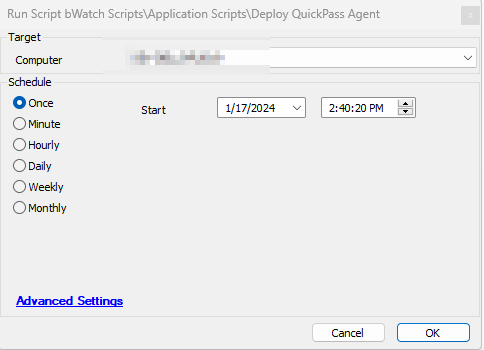
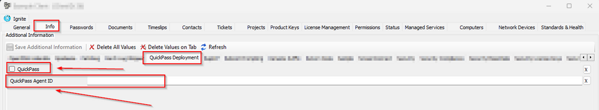
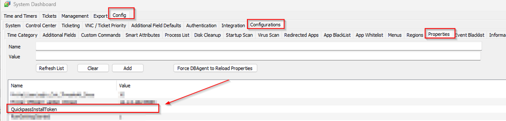
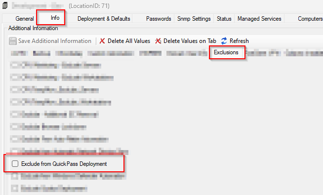
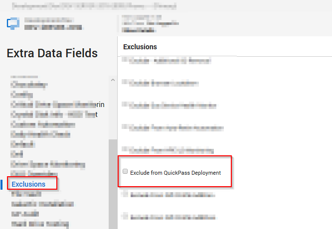

## Summary

This script installs the QuickPass Agent on Windows machines where it is not already installed. The `QuickPass` EDF must be selected, and the `QuickPass Agent ID` EDF should be populated with the specified CustomerID at the client level. Additionally, the System Property `QuickpassInstallToken` must be filled with the installation token to ensure the script installs the agent successfully.

## Sample Run

## Dependencies

[SWM - Software Install - Internal Monitor - Agents Missing QuickPass](https://proval.itglue.com/DOC-7339781-14875676)

## Global Parameters

| Name                    | Required | Example | Description                                                                                                    |
|-------------------------|----------|---------|----------------------------------------------------------------------------------------------------------------|
| Ticket_On_Failure       | False    | 1       | Fill it as '1' if you would like to receive a ticket on failure; otherwise, leave it blank or set it to '0'. |
| TicketCreationCategory   | False    | 298     | Mention the ticket creation category to direct the tickets to the right board in Manage                      |

## User Parameter

| Name              | Required | Example | Description                                                                                                    |
|-------------------|----------|---------|----------------------------------------------------------------------------------------------------------------|
| Set_Environment    | False    | 1       | Running the script with the user parameter `Set_Environment` as `1` will import the System Property `QuickpassInstallToken` needed for the script. <em><strong>Note:</strong> Set to 1 for first-time implementation.</em> |

## System Property

| Name                  | Required | Example                     | Description                                                                                                    |
|-----------------------|----------|-----------------------------|----------------------------------------------------------------------------------------------------------------|
| QuickpassInstallToken  | True     | d7ksgi-yh67-kdsh77-jd888   | It must be filled with the installation token to initiate the QuickPass Agent installation                     |

## Extra Data Fields

| EDF Name                              | Level    | Type      | Description                                                                                                    |
|---------------------------------------|----------|-----------|----------------------------------------------------------------------------------------------------------------|
| QuickPass                             | Client   | CheckBox  | Check it if you would like to enable the client for QuickPass Deployment                                      |
| QuickPass Agent ID                   | Client   | TextField | Populate it with the specified CustomerID at the client level to initiate the installation on targeted client machines |
| Exclude from QuickPass Deployment     | Location | CheckBox  | Check it if you would like to exclude a location from QuickPass Deployment                                     |
| Exclude from QuickPass Deployment     | Computer | CheckBox  | Check it if you would like to exclude a computer from QuickPass Deployment                                     |

- The `QuickPass` EDF must be selected, and the `QuickPass Agent ID` EDF should be populated with the specified CustomerID at the client level to initiate the installation on targeted client machines.  
  
<em>For more information on how to fetch the QuickPass Agent ID, refer to the document [Export Customers List, Status and Agent IDs – CyberQP (getquickpass.com)](https://support.getquickpass.com/hc/en-us/articles/360061942274-Export-Customers-List-Status-and-Agent-ID-s).</em>

- The System Property `QuickpassInstallToken` must be filled with the installation token to initiate the QuickPass Agent installation.  
  
<em>The QuickPass Installation Token can be fetched from the Quickpass Dashboard. Navigate to the Settings Menu and then to the Admin Login Details section. Click the COPY button for the Install Token.</em>

- Select the location-level EDF `Exclude from QuickPass Deployment` to exclude the desired location from receiving the QuickPass agent deployment.  

- Select the computer-level EDF `Exclude from QuickPass Deployment` to exclude the desired machine from receiving the QuickPass agent deployment.  

## Output

- Script Logs
- Ticketing

## Ticketing

**Subject:** `QuickPass Agent Installation Failed on %ComputerName%(%ComputerID%)`

**Ticket Body:** `Failed to install QuickPass Agent on %computername% at %clientname%. Here are the results returned from the installer: %shellresult%`

The PC information is outlined below:  
PC Name: %computername%  
Last Login: %lastuser%  
PC Model: @biosname@  
OS: %os%  
S/N OF PC: @biosver@

When the script fails to download the installer:

`QuickPass Agent failed to download on %computername% at %clientname%. Please ensure that the computer can reach the download URL [https://storage.googleapis.com/qp-installer/production/Quickpass-Agent-Setup.exe](https://storage.googleapis.com/qp-installer/production/Quickpass-Agent-Setup.exe)`

The PC information is outlined below:  
PC Name: %computername%  
Last Login: %lastuser%  
PC Model: @biosname@  
OS: %os%  
S/N OF PC: @biosver@

