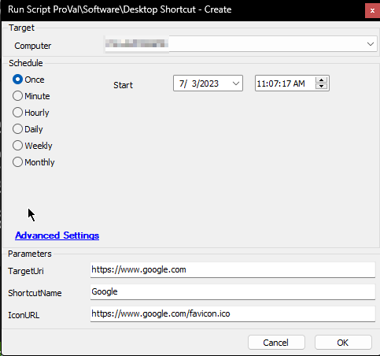
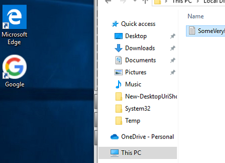
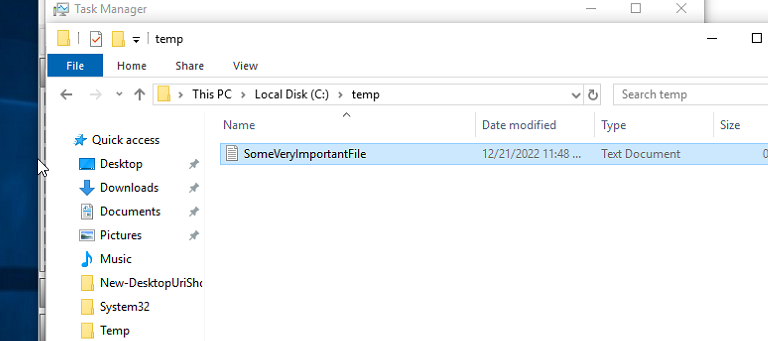
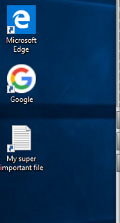

## Summary

This document explains how to create a desktop shortcut for all users.

## Sample Run

  
  
  
  
  

## Dependencies

- [EPM - Windows Configuration - Agnostic - New-DesktopUriShortcut](<../../powershell/New-DesktopUriShortcut.md>) 

### User Parameters

| Name          | Example                                                                                   | Required | Description                                                       |
|---------------|-------------------------------------------------------------------------------------------|----------|-------------------------------------------------------------------|
| TargetUri     | [https://www.google.com](https://www.google.com) or C:/Somedirectory/somefile.someextension | True     | The shortcut target.                                             |
| ShortcutName  | SomethingIWantToCallThis                                                                  | False    | The name of the shortcut as seen on the desktop.                |
| IconURL       | [https://www.google.com/favicon.ico](https://www.google.com/favicon.ico)                 | False    | Download URL to download the *.ico file to set as the shortcut's icon. |

## Process

Please reference the agnostic documentation for the process.

